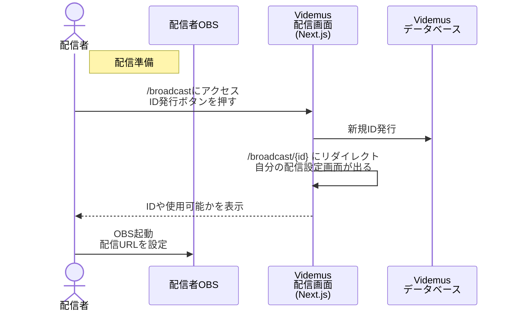
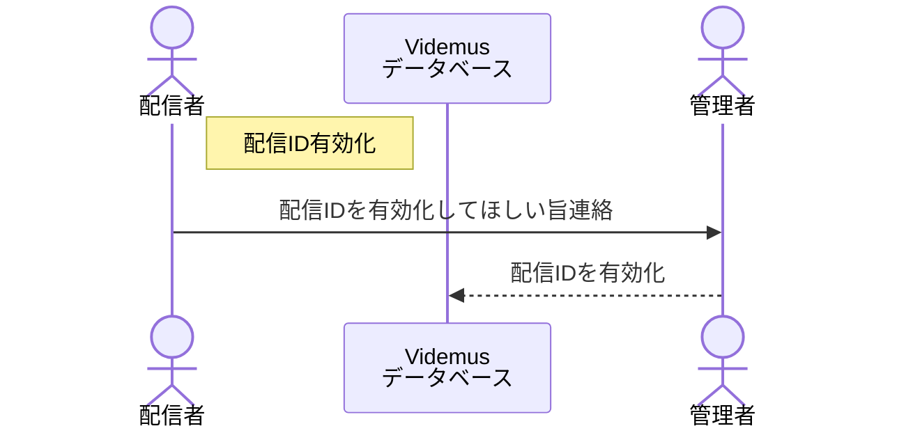
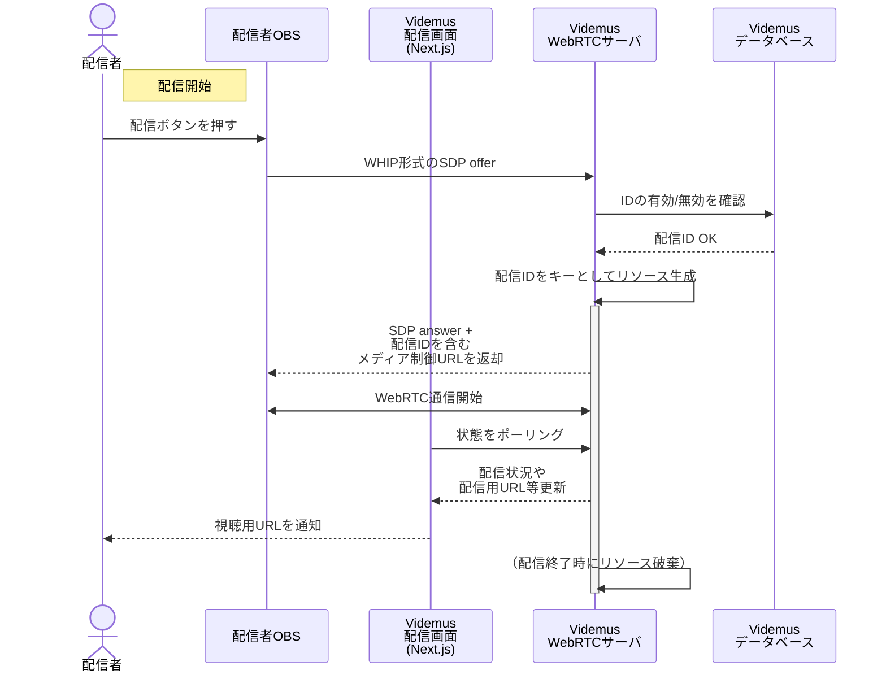
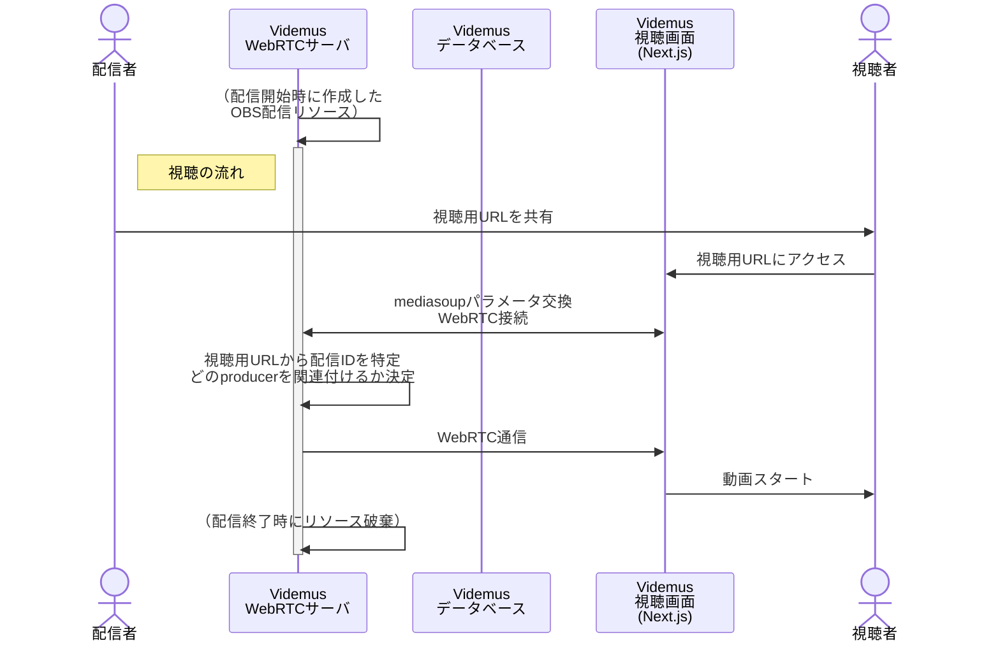
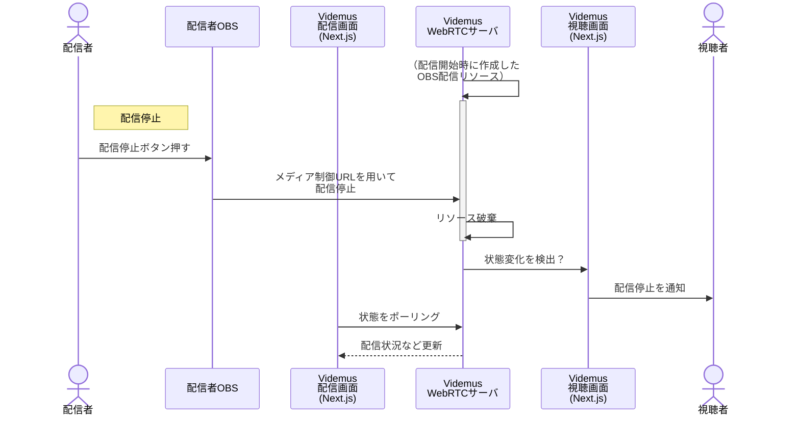
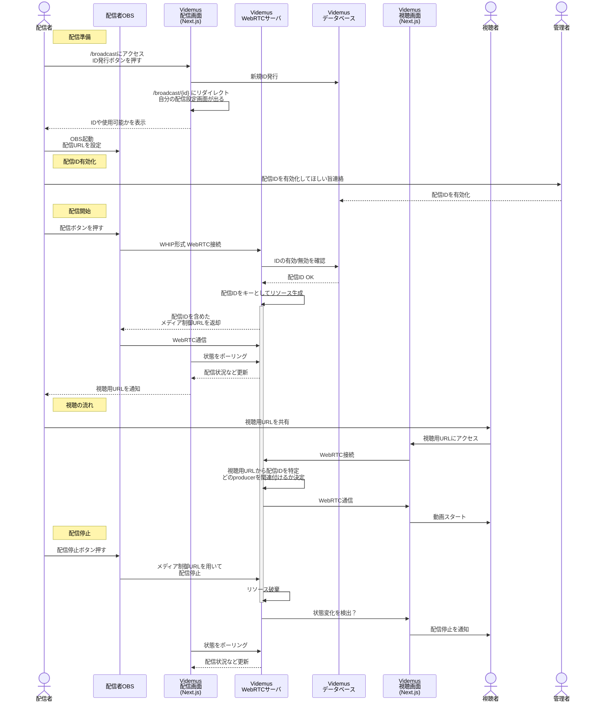

# 背景
**低遅延な動画配信サーバを自分で作れないだろうか？** というモチベーションで開発を行いました。

友人とゲーム画面を共有しながら通話して遊んでいるのですが、Stream Broadcastの遅延や画質が少々ストレスだったのが発端です。

# できたもの
遅延も画質も満足できるものになりました！

*配信遅延は0.6秒くらいでしょうか*

*トップページ*

*OBS設定案内付きの配信制御ページ*

https://github.com/Daiius/videmus

# 技術スタック
一人でフルスタック開発する関係で、両方カバーするフレームワーク/ライブラリを積極的に採用します。メジャーなもの、かつオープンソースのものを選ぶようにも心掛けています。
:::details また、全部TypeScriptで書ることを中心に技術選定します。
フロントエンド開発のメジャーどころが JavaScript or TypeScript に限定され、静的型付き言語を使いたくて、複数言語を頭の中で切り替えるのがちょっと面倒で、という結果TypeScript統一になりました。

TypeScriptが完全だとは言えませんが、「動かしてみないと分からない」要素が多いのは現代において余りにも...という思想です。

要は静的型付き言語大好きです、Rustも好きです。たまにPythonに浮気して酷い目に遭います。
:::

- [**mediasoup**](https://mediasoup.org/)
  @[card](https://mediasoup.org/)
  - **これは何？**
    今回の主役です、ブラウザとも相性が良くリアルタイム性の高い通信方式 WebRTC でもって、
    1対多、もしくは多対多通信を効率良く行う SFU という仕組みを使うためのライブラリです
  - **どう使う？**
    - サーバサイドで動作させ、動画配信アプリケーション（OBS）からのデータを受け取ります
    - 受け取ったデータを視聴用ページを開いたブラウザからのリクエストを受けて送信します
    - クライアントサイド向けの mediasoup-client もあります
- [**Next.js**](https://nextjs.org/)
  @[card](https://nextjs.org/)
  - **これは何？**
    - ReactベースのWebアプリケーション用フレームワークです
    - レンダリング済みのHTMLデータを返すServer Side Rendering動作を行う他、沢山の最適化手法を持ちます
  - **どう使う？**
    - appディレクトリ以下のファイル/ディレクトリ構成を元にルーティングを行って複数ページを表示できます ([App Router](https://nextjs.org/docs/app)機能)
    - リクエストを挟んで継続する状態を保持する機能はありません
      専用のAPIサーバやデータベースを用意する方が理に適っているのでしょう
      [ここ](https://nextjs.org/learn/react-foundations/what-is-react-and-nextjs)らへんに何であるか/でないかの思想が表れていそうです
- [**express.js**](https://expressjs.com/)
  @[card](https://expressjs.com/)
    - **これは何？**
      - node.js上で動く軽量なWebフレームワークです
    - **どう使う？**
      - mediasoupで動画データを送受信する前に、HTTP通信による事前準備を担当します
      - Next.jsのみだとmediasoup関連のオブジェクトを保持できない（前述）ので、express.jsサーバ中でmediasoup関連のリソースを保持します
- [**MySQL**](https://www.mysql.com/)
  @[card](https://www.mysql.com/)
    - **これは何？**
        - 軽量な動作をするメジャーなオープンソースのデータベースです
        - Relational Modelを活用すれば、矛盾しにくいデータベースを構築できます
    - **どう使う？**
        - 配信者に発行したIDなど永続化して欲しいデータをここに入れます
          毎回変わるとOBSに入力するのが面倒だと判断しました
        - 配信者IDが有効or無効かのフラグも記録します
          連絡をもらったら管理者が手動で有効化するローテク方針です
          - 以前作った物と同様にAuth.jsで認証機能を入れるのがカッコいいですが、友人のみに許可する場合には大袈裟すぎると判断しました
- [**Drizzle ORM**](https://orm.drizzle.team/)
  @[card](https://orm.drizzle.team/)
    - **これは何？**
        - TypeScriptでテーブル定義を記述してデータベース管理が出来るほか、
          ORMと呼ばれる仕組みを提供します
    - **どう使う？**
        - Drizzle ORMを通してTypeScript型システムの恩恵を得ながらデータ入出力を行えます
        - TypeScriptで定義したテーブル構造をバージョン管理することで、
          データベース構造の管理もgitで行えます

:::details ちなみにNginxのRTMPモジュールも試したのですが...
10秒程度の遅延を解消することが困難で、今回の用途には合わないと判断しました。
:::
         
# システム全体の動作
シーケンス図で動作を整理します。

最初に **配信IDの取得** 処理を配信者に行ってもらいます。

次に **配信IDの有効化** を配信者と管理者が連絡を取って行います。
ローテクですが、不特定多数の方に使用して頂くとサーバが持ちませんので...

いよいよ **配信を開始します**。
OBSからWHIP形式のWebRTC通信を受信します。

配信開始時に、配信者用ページに視聴用URLが表示されます。
視聴者がアクセスすることで、**動画視聴がスタートします**

最後の***配信停止**時に、サーバで確保していた各種リソースを開放します。

:::details 全部繋げたシーケンス図はこんな感じです...

:::

# 既存のよく似たサービス
- **[Google Meet](https://meet.google.com/)**:
    - **主な類似点**：
        - WebRTCを利用した低遅延なブラウザへの動画配信
    - **主な相違点**：
        - 1対2以上で配信する場合、無料プランだと1時間毎に配信をし直す必要があります
        - Webミーティング向けに十分な機能のUIを持ちます
        - OBSと直接繋がるのでなく、仮想カメラ経由で接続します
- **[Sora](https://sora.shiguredo.jp/)**
    - **主な類似点**：
        - WebRTC SFU を利用した低遅延な動画配信
    - **主な相違点**：
        - 映像・音声・データのリアルタイム配信と、その録音録画まで可能な柔軟・多機能なサービスです

Sora開発者の方はZennでも多数の記事を公開していらっしゃいます。
本記事のアプリケーション開発時、私は「そもそも出来るのかな...」と思いながらやっていましたので、お手本的な記事を読めるのは大変心強かったです。
https://zenn.dev/p/shiguredo

# おわりに
まだまだ公式ドキュメントを読み込む能力が足りず、
本格的に mediasoup のドキュメントを読み込むのは開発中盤以降でした...。

自分のレベルアップよりも、ライブラリや情報の充実によって動いた感がありますが、
最初のイメージにかなり近い動作を実現できたのは嬉しいです！

# 自己紹介
::::details 自分の紹介...
趣味+メーカ系企業で研究開発支援のためのシステム構築やプログラミングを行っています。

この道で仕事をしたくなり、IT系企業への転職活動も兼ねてNext.js Webアプリケーション中心に技術調査を行っています。

「誰が使うか、どこまで必要とするか」を明確にし、どこかが過剰性能になったりしない様にサービスを作ることを意識しています。

インフラ周りに関しても、サーバ・DNSも自分で契約してDockerを使って本番環境を運営しています。
:::details Vercel 他 便利な配置用サービスはあるのですが...
Webアプリケーションは色々な作り方や配置の仕方が有るものですから、
何か特定のものを使わないと出来ない、というのは避けたくなりました。
もちろん、出来るだけ低レイヤーな部分から触りたいという欲求もあります。
:::
::::
:::details 最近作ったもの...
趣味で開発しているWebアプリケーションは以下になります、主な技術スタックも示します。
- [**犬がToDoを食べてしまうジョークアプリ**](https://zenn.dev/daiius/articles/14e62bd0770de3)
    - Next.js
    - 完全に自分用です、何もしたくなくなった方はどうぞ！
- [**セキレイが尻尾を振るToDoリスト**](https://zenn.dev/daiius/articles/b624d872db55d4)
    - Next.js + Auth.js (Github) + Drizzle ORM + MySQL
    - 犬の代わりに小鳥が出ます、タスクは食べられる事なくデータベースに記録されます
- [**ゲームの推しキャラ組み合わせアンケート**](https://zenn.dev/daiius/articles/08c65823dae37d)
    - Next.js + Auth.js (X/Twitter) + Drizzle ORM + MySQL
    - 対象ゲームUIに合わせた Tailwind CSS によるスタイルにもこだわりました
    - 500人程の方に投票いただきました！実運用サーバの負荷を観察することが出来ました
:::

