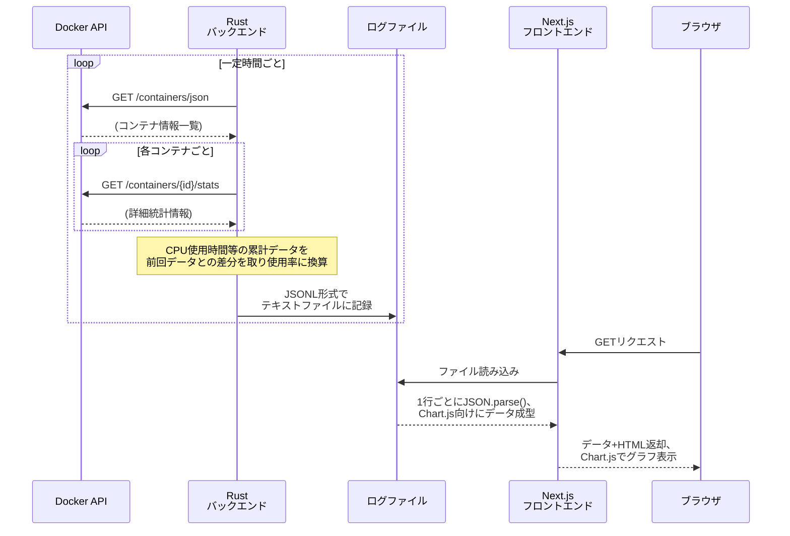

## シンプルなプログラムで本番環境のサーバ負荷ログを取りたい
と思って、最初は Linux 環境の `/proc` 以下にある疑似ファイルを読む Rust コードを書こうとしていました。
@[card](https://github.com/torvalds/linux/blob/master/Documentation/filesystems/proc.rst)

本番環境では Docker で管理しているため、途中まで作ったところで **自分の本当に欲しいもののはちょっと違う気がする......** となり、Docker API を使ったコードに書き直しました。
Dockerを使っている皆さんお馴染みの、`/var/run/docker.sock` は REST API エンドポイントとして使えます。
@[card](https://docs.docker.com/reference/api/engine/version/v1.47/)

Githubリポジトリはこちら。
https://github.com/Daiius/cephylas

こんな感じのグラフが出力される様になりました！


## 仕組み


## 語りたいこと
### ☆ Docker API + Rust側処理
シンプルな REST API エントリポイントを用意してくれており、かなり低レベルなプログラムからもアクセス可能です。
**今回作成した Rust バックエンドは軽量な [json クレート](https://docs.rs/json/latest/json/) 以外には依存関係がありません。HTTP関連のライブラリさえ使っていません。** Request は手書きで、Response 処理はごく単純な文字列処理だけで実装しました。
- **メリット**
  とっても軽量
- **デメリット**
  Headerを完全に無視している・特定のエンコーディングしか対応していない
  一応 [HTTP RFC ドキュメント](https://datatracker.ietf.org/doc/html/rfc2616) を読んだので許してください......

```rust:超お手軽 HTTP request 送信例
fn call_docker_api<
    P: AsRef<std::path::Path>,
    S: AsRef<str>,
>(
    socket_path: P,
    url: S,
) -> Result<String, std::io::Error> {
    let mut stream = std::os::unix::net::UnixStream::connect(socket_path)?;
    let request = format!(
        "GET {} HTTP/1.1\r\n\
         Host: localhost\r\n\
         Connection: close\r\n\
         \r\n",
        url.as_ref()
    );
    std::io::Write::write_all(&mut stream, request.as_bytes())?;
    let mut response = String::new();
    std::io::Read::read_to_string(&mut stream, &mut response)?;
    Ok(response)
}
```

```rust:超お手軽 HTTP response 解析例
fn get_container_stats<
    T: AsRef<std::path::Path>,
    U: AsRef<str>,
>(
    socket_path: T,
    container_name: U,
) -> Result<json::JsonValue, error::Error> {
    let response = call_docker_api(
        socket_path, 
        DOCKER_API_STATS.replace("{}", container_name.as_ref()),
    )?;
    let stats_data = response.lines()
        .find(|l| l.starts_with('{')) // 成功したら特定形式の JSON が返る
        .ok_or("cannot find response json body")?;
    let stats = json::parse(stats_data)?;
    let stats_json = reshape_json(&stats);

    Ok(stats_json)
}
```
### ☆ リソース使用率の算出には 引き算 と 割り算 を多用
Linux における CPU、ディスク、ネットワーク 使用に関する情報は積算値になっています。
Docker API から取得できるリソース使用関連の情報も積算値です。

**CPU使用率(%)、ディスク使用(kB/s 等)、ネットワーク使用(Mbps 等) の値を計算するには、
ある程度時間をおいて 2回 その値を取得して差を取った上で、更に時間間隔で割り算する等の計算が必要です。**

`docker stats` も `top` も `htop` も、Linux が提供する積算値を一定間隔で読み取ってリソース使用率を計算しています。
様々なOS、言語、フレームワーク、API がリソース使用率の取得機能を実装していると思いますが、どんな仕組みで動いているか思いを馳せてみるのも楽しそうです。
### ☆ 1万行以上 の大きな JSONL ログファイル処理には注意
**上記のリソース使用率計算 + 前処理のJSONLパース を 1万行以上のログファイル に対して Node.js 環境で処理を行う場合、それなりの覚悟が必要そう**でした。
私のTypeScript技量では 処理時間約0.8s + メモリ数百MB消費 という激重コードから改善出来ず、差分計算も Rustバックエンド で行うことにしました。

## このプログラムの個人的な使い道
以前作ったこの Next.js アプリケーション、パフォーマンス面でちょっと問題がありまして、その解析に使えそうです。
https://zenn.dev/daiius/articles/08c65823dae37d

また、自作の OBS 向け動画配信 Web アプリケーションもパフォーマンス面で結構シビアなので、使用中のデータを確認してみます。
https://zenn.dev/daiius/articles/441f35223269a6

## おわりに
シンプルなリソース使用率取得プログラムを作るつもりが、Linuxの仕組みの一部からHTTPリクエストのRFCまで幅広く勉強することが出来ました。想像したよりも良い勉強になったと感じます。
フロントエンドをもう少し使いやすく改良していきます！
