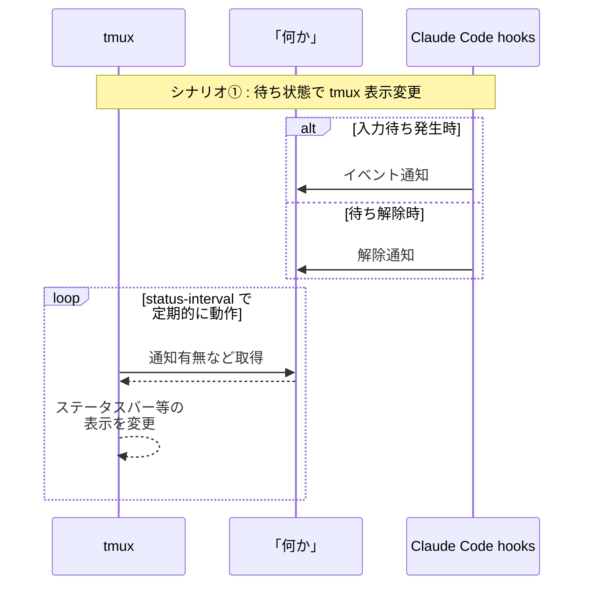
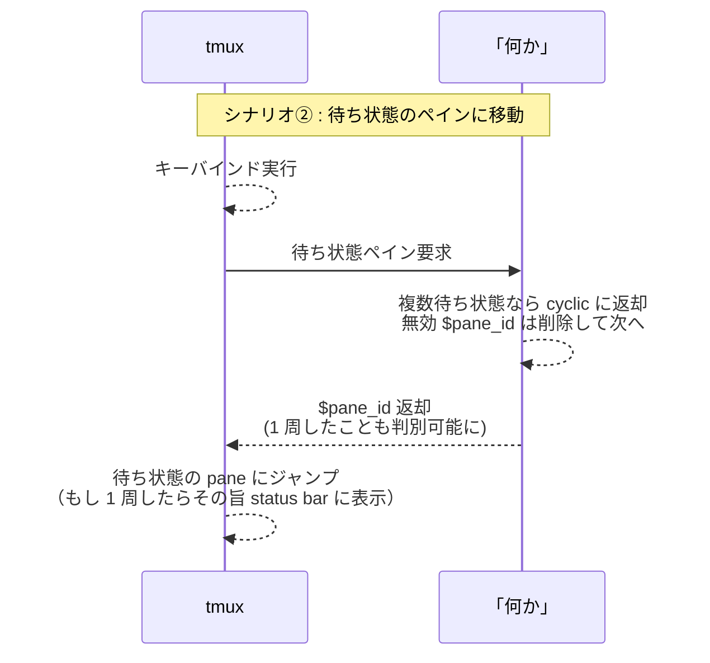

## 概要

Claude Code や Codex CLI といった coding agents 使用方法の最近の傾向として、自律的に動作する時間が長くなっています。
次の入力までの待ち時間が随分と長くなり、更に複数の coding agents を tmux のあちこちのペインで同時に走らせたりすると、**「いつの間にか、どこかで誰かが返事を待っている」状態になりがち**です。

権限要求のダイアログが出ているペイン、ターンが終わって次のプロンプトを待っているペイン、長いビルドが終わったまま放置されているペイン……。

これを解決するために **bellmux** という小さな CLI を作りました。

@[card](https://github.com/Daiius/bellmux)

## どう使うのか

*デモ動画：Claude Code x 2, Codex CLI x 1 セッションを、tmux の 2 session 3 panes で操作*

動画では Claude Code / Codex CLI の入力待ち発生時に音を鳴らしたり、status bar の色を変更しています。
**挙動や見た目は coding agents や tmux のカスタマイズ次第** で、bellmux は複数通知の記録やハンドリングに集中しています。

## 機能
tmux と coding agents の間を繋ぐ **最小限の機能を意識しています**。

1. **イベント通知**：
  「このペインで待ち状態になったよ」という、通知を記録する機能
2. **イベント解除**
  「このペインの待ち状態が解除されたよ」という、該当する通知を削除する機能
3. **イベント有無返却**
  「待ち状態のペインがあるよ」という、単純な読み取り機能
4. **通知の来た pane\_id を 1 つずつ返却**
  「次の待ち状態のペインはこれだよ」という、順序の付いた読み取り機能

tmux には run-shell コマンドが、coding agents には hooks があります。
適切なタイミングでスクリプトを実行する仕組みが既に用意されているため、実装するべき機能は少ないです。
```bash
# tmux の run-shell
# キーバインドで任意のコマンドを実行する様に設定できます
bind-key a run-shell '任意のコマンド・スクリプト'
```
```json
// Claude Code の hooks
// Codex CLI にも類似の仕組みがあり、
// 様々なイベント発生時にスクリプトを実行できます。
"Notification": [ // ← Stop, UserPromptSubmit, PostToolUse など様々
  {
    "matcher": "",
    "hooks": [
      {
        "type": "command",
        "command": "任意のコマンド・スクリプト"
      }
    ]
  }
],
```

## 主な動作のシーケンス図
### シナリオ①：入力待ち発生時に tmux の status-bar 表示変更

### シナリオ②：入力待ち通知のあったペインにジャンプ


## tmux との連携設定
興味のある方向けに、tmux と coding agents の設定例をもう少し詳しく示しています。

:::details tmux キーバインド

`bellmux init --preset keybinds` で出力される、未対応ペイン巡回用のキーバインドです。

```sh
# 次の未対応ペインへジャンプ
bind-key a run-shell '
  read -r pane tag <<<"$(bellmux next)"
  if [ -z "$pane" ]; then
    tmux display-message "No pending notifications"
    exit 0
  fi
  tmux switch-client -t "$pane"
  if [ "$tag" = wrapped ]; then
    tmux display-message "Cycled through all pending notifications."
  fi
'

# 手動 ack
bind-key A run-shell 'bellmux ack-pane --pane-id "#{pane_id}" && tmux refresh-client -S'
bind-key X run-shell 'bellmux ack-all && tmux refresh-client -S'
```

| キー | 動作 |
|---|---|
| `prefix + a` | 次の未対応ペインへジャンプ（古い方向へ巡回） |
| `prefix + b` | 前の未対応ペインへジャンプ（新しい方向へ巡回） |
| `prefix + A` | 現在ペインの通知を全 ack |
| `prefix + X` | 全 ack |

**`bellmux next` 自身は ack しません**。「見に行っただけかもしれない」ので、ack は明示操作（`UserPromptSubmit` / `PostToolUse` / `PostToolUseFailure` / `prefix + A` など）でしか起きません。
:::

:::details Claude Code hooks 設定

bellmux の最初のモチベーションは Claude Code との協調だったので、`~/.claude/settings.json` に貼る hook が一番磨かれています。`bellmux init --preset claude-hooks` で出力されるのはこちら。

```json
{
  "hooks": {
    "Notification": [{
      "matcher": "permission_prompt|elicitation_dialog",
      "hooks": [{"type": "command", "command": "bellmux push --kind notification --pane-id \"$TMUX_PANE\" && bellmux bell"}]
    }],
    "Stop": [{
      "matcher": "",
      "hooks": [{"type": "command", "command": "bellmux push --kind stop --pane-id \"$TMUX_PANE\" && bellmux bell"}]
    }],
    "UserPromptSubmit": [{
      "matcher": "",
      "hooks": [{"type": "command", "command": "bellmux ack-pane --pane-id \"$TMUX_PANE\""}]
    }],
    "PostToolUse": [{
      "matcher": "",
      "hooks": [{"type": "command", "command": "bellmux ack-pane --pane-id \"$TMUX_PANE\""}]
    }],
    "PostToolUseFailure": [{
      "matcher": "",
      "hooks": [{"type": "command", "command": "bellmux ack-pane --pane-id \"$TMUX_PANE\""}]
    }],
    "SessionEnd": [{
      "matcher": "",
      "hooks": [{"type": "command", "command": "bellmux ack-pane --pane-id \"$TMUX_PANE\""}]
    }]
  }
}
```

各 hook の対応は次の通りです。

| Hook | タイミング | bellmux 動作 |
|---|---|---|
| Notification | 権限要求 / MCP 入力要求 (elicitation) | `push --kind notification && bell` |
| Stop | ターン完了 | `push --kind stop && bell` |
| UserPromptSubmit | 新しいプロンプト送信 | `ack-pane` |
| PostToolUse | ツール実行完了（成功） | `ack-pane` |
| PostToolUseFailure | ツール実行失敗 | `ack-pane` |
| SessionEnd | セッション終了 | `ack-pane` |

**ポイントは `Notification` の matcher です。** `permission_prompt|elicitation_dialog`（権限ダイアログ / MCP サーバーの入力要求）に一致したときだけ hook が発火し、idle ping などはそもそも bellmux に届きません。**「どの通知を拾うべきか」の判断を hook 設定側に寄せた**結果、bellmux 本体は coding agent の通知種別（`notification_type`）を一切知りません。surface 対象を増やしたいときは matcher に `|` 区切りで足すだけで、bellmux は無変更です。
:::

:::details Codex CLI hooks 設定

Codex CLI も同じ要領で連携できます。設定はユーザースコープの `~/.codex/hooks.json` に置きます（Claude Code の `settings.json` とは別ファイル）。`bellmux init --preset codex-hooks` で出力されるのはこちら。

```json
{
  "hooks": {
    "PermissionRequest": [{
      "matcher": "",
      "hooks": [{"type": "command", "command": "printf '%s' '{\"message\":\"Codex needs approval\"}' | bellmux push --kind notification --pane-id \"$TMUX_PANE\" && bellmux bell"}]
    }],
    "Stop": [{
      "matcher": "",
      "hooks": [{"type": "command", "command": "printf '%s' '{\"message\":\"Codex turn complete\"}' | bellmux push --kind stop --pane-id \"$TMUX_PANE\" && bellmux bell"}]
    }],
    "UserPromptSubmit": [{
      "hooks": [{"type": "command", "command": "bellmux ack-pane --pane-id \"$TMUX_PANE\""}]
    }],
    "PostToolUse": [{
      "matcher": "",
      "hooks": [{"type": "command", "command": "bellmux ack-pane --pane-id \"$TMUX_PANE\""}]
    }],
    "SessionStart": [{
      "matcher": "startup|resume|clear",
      "hooks": [{"type": "command", "command": "bellmux ack-pane --pane-id \"$TMUX_PANE\""}]
    }]
  }
}
```

各 hook の対応は次の通りです。

| Hook | タイミング | bellmux 動作 |
|---|---|---|
| PermissionRequest | コマンド承認要求 | `push --kind notification && bell` |
| Stop | ターン完了 | `push --kind stop && bell` |
| UserPromptSubmit | 新しいプロンプト送信 | `ack-pane` |
| PostToolUse | ツール実行完了 | `ack-pane` |
| SessionStart | セッション開始 / 再開 / clear | `ack-pane` |

**Claude Code との差分は「イベント名」と「matcher の要否」だけ**です。

- 承認要求のイベントが `Notification` ではなく `PermissionRequest` で、これは承認要求専用イベントなので matcher で種別を絞る必要がなく `""` のままで済みます。
- セッション系は `SessionEnd` ではなく `SessionStart`（`startup|resume|clear`）で、起動・再開時に古い通知を掃除します。
- 通知メッセージは `printf '%s' '{...}' | bellmux push` と固定 JSON を stdin で流しているだけです。bellmux 側はやはり通知種別を知らないので、**どちらの agent でも push / ack-pane という同じ語彙**で繋がります。
:::

## tmux / coding agents 以外の組み合わせもOK
様々なツールと組み合わせて使用可能です。

- **特定の coding agent に依存しません**
  - 受け取った通知をそのまま記録するだけで、「どれを拾うか」は前述の通り hook の matcher 任せです（Codex 用プリセットも固定 JSON を流すだけ）
  - なんなら shell script 実行さえできれば任意のツールから bellmux を呼び出せます
- **Linux / macOS / Windows (WSL2, MSYS, etc...)  でも OK**
  - 実際にすべてのプラットフォームで動作させた訳ではないですが、原理的には幅広い OS で動作するはずです
- **Zellij や screen にも対応...のはず** 
  - snippet を追加するだけ、bellmux 側は無変更です
  - screen は画面管理の単位が若干異なるため、完全に同じようには動作しなそうです
  - Windows ネイティブ向けの tmux ライクなアプリケーションとも使用できそうです

## おわりに
「 tmux で複数の coding agents を同時に走らせる時、入力待ちペインにジャンプしたい」という課題の解決策は色々ありそうです。同じ課題にアプローチするもの、似ている発想のものは色々あります。
@[card](https://cmux.com)
@[card](https://code.claude.com/docs/ja/agent-view)
@[card](https://github.com/shuntaka9576/agentoast)
@[card](https://zenn.dev/kki2ne/articles/claude-code-hooks-macos-notification-2026)
@[card](https://lib.rs/crates/tmux-claude-queue)

bellmux は「特定の OS / coding agents に依存していない」ことが特徴になっていそうです。
色々なアプローチがある中で、1 つ面白い例になっているといいなと思います。

## おまけ：名前の由来になった事実上のボツ機能紹介
「通知はベル文字送信に限定 → ターミナル側でハンドルしよう」ですとか、「別セッションからターミナル経由で音を鳴らすためにユーザーの全 tty にベル文字を送ろう」と考えていた名残で、POSIX 系 OS 依存機能、`bellmux bell` コマンドがあります。


今は OS の音声ファイル再生コマンドの方が確実に音を鳴らせるので便利かなと考えています。

「音声ファイルを再生できない環境で、異なる tmux session からでも bell 文字でブザーを鳴らしたい」という方がいらっしゃったら是非試してみて下さい！
