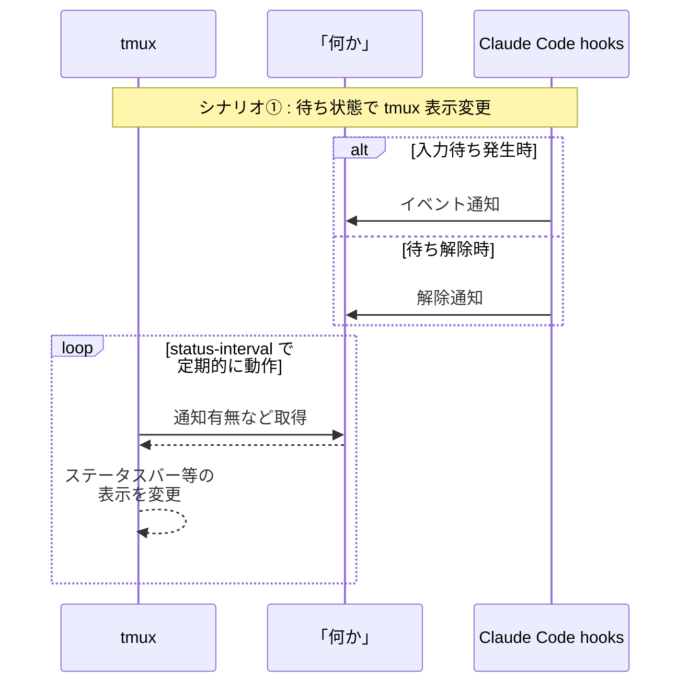
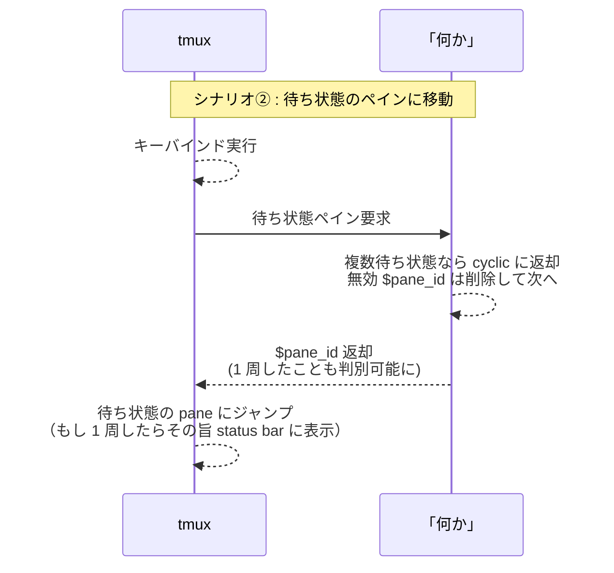

## 何を作ったのか

**Claude Code を tmux のあちこちのペインで同時に走らせていると、「どこかで誰かが返事を待っている」状態になりがち**です。

権限要求のダイアログが出ているペイン、ターンが終わって次のプロンプトを待っているペイン、長いビルドが終わったまま放置されているペイン……。

これを解決するために **bellmux** という小さな CLI を作りました。

@[card](https://github.com/Daiius/bellmux)

## 何ができるのか

## ......何を作ったのか??
実は、何を作ったのか正確なところは良くわかっていません。

tmux / Claude Code (hooks) を意識して作りつつ、その間を繋ぐ **最小限の機能を意識した結果、単体で何と呼ぶべきか分からないものになっていました**。

> AI は attention queue という名前を提案するのですが... 通知ハンドラー？みたいな感じでしょうか...

### 背景 : tmux / Claude Code 共にカスタマイズ性が高い
tmux / Claude Code には、適切なタイミングでスクリプトを実行する仕組みがあります。それを踏まえると、実装するべき機能は少ないです。

シーケンス図も書いてみたのですが、以下の 4 つの機能があれば良さそうです：
1. **イベント通知**：
  「このペインで待ち状態になったよ」という、通知を記録する機能
2. **イベント解除**
  「このペインの待ち状態が解除されたよ」という、該当する通知を削除する機能
3. **イベント有無返却**
  「待ち状態のペインがあるよ」という、単純な読み取り機能
4. **通知の来た pane\_id を 1 つずつ返却**
  「次の待ち状態のペインはこれだよ」という、順序の付いた読み取り機能
:::details tmux: run-shell の具体例
```bash
# tmux はキーバインドで任意のコマンドを実行する様に設定できます
bind-key a run-shell '任意のコマンド・スクリプト'
```
:::
:::details Claude Code: hooks の具体例
```json
// Claude Code は hook という仕組みで、様々なイベント発生時にスクリプトを実行できます。
"Notification": [ // ← Stop, UserPromptSubmit, PostToolUse など様々
  {
    "matcher": "",
    "hooks": [
      {
        "type": "command",
        "command": "任意のコマンド・スクリプト"
      }
    ]
  }
],
```
:::






これを素朴に実装すると、出来たものはそれらを繋ぐための「何か」...小さな、抽象的な CLI になりました。

## tmux / Claude Code との連携
興味のある方向けに、tmux / Claude Code の設定内容をもう少し詳しく示しています。

:::details tmux キーバインド

`bellmux init --preset keybinds` で出力される、未対応ペイン巡回用のキーバインドです。

```sh
# 次の未対応ペインへジャンプ
bind-key a run-shell '
  read -r pane tag <<<"$(bellmux next)"
  if [ -z "$pane" ]; then
    tmux display-message "No pending notifications"
    exit 0
  fi
  tmux switch-client -t "$pane"
  if [ "$tag" = wrapped ]; then
    tmux display-message "Cycled through all pending notifications."
  fi
'

# 手動 ack
bind-key A run-shell 'bellmux ack-pane --pane-id "#{pane_id}" && tmux refresh-client -S'
bind-key X run-shell 'bellmux ack-all && tmux refresh-client -S'
```

| キー | 動作 |
|---|---|
| `prefix + a` | 次の未対応ペインへジャンプ（古い方向へ巡回） |
| `prefix + b` | 前の未対応ペインへジャンプ（新しい方向へ巡回） |
| `prefix + A` | 現在ペインの通知を全 ack |
| `prefix + X` | 全 ack |

**`bellmux next` 自身は ack しません**。「見に行っただけかもしれない」ので、ack は明示操作（`UserPromptSubmit` / `PostToolUse` / `prefix + A`）でしか起きません。
:::

:::details Claude Code hooks 設定

bellmux の最初のモチベーションは Claude Code との協調だったので、`~/.claude/settings.json` に貼る hook が一番磨かれています。`bellmux init --preset claude-hooks` で出力されるのはこちら。

```json
{
  "hooks": {
    "Notification": [{
      "matcher": "",
      "hooks": [{"type": "command", "command": "bellmux push --kind notification --pane-id \"$TMUX_PANE\" && bellmux bell"}]
    }],
    "Stop": [{
      "matcher": "",
      "hooks": [{"type": "command", "command": "bellmux push --kind stop --pane-id \"$TMUX_PANE\" && bellmux bell"}]
    }],
    "UserPromptSubmit": [{
      "matcher": "",
      "hooks": [{"type": "command", "command": "bellmux ack-pane --pane-id \"$TMUX_PANE\""}]
    }],
    "PostToolUse": [{
      "matcher": "",
      "hooks": [{"type": "command", "command": "bellmux ack-pane --pane-id \"$TMUX_PANE\""}]
    }]
  }
}
```

各 hook の対応は次の通りです。

| Hook | タイミング | bellmux 動作 |
|---|---|---|
| Notification | 権限要求 / 60 秒アイドル | `push --kind notification && bell` |
| Stop | ターン完了 | `push --kind stop && bell` |
| UserPromptSubmit | 新しいプロンプト送信 | `ack-pane` |
| PostToolUse | ツール実行完了 | `ack-pane` |
:::

## tmux / Claude Code 以外の組み合わせもOK
bellmux は非常にシンプルで、**tmux にも Claude Code にも依存していません**。
様々なツールと組み合わせて使用可能です。

1. `pane_id` は、内部的には文字列キー
  - `bellmux push --pane-id %42` の `%42` は tmux のフォーマットですが、bellmux 内部では **これを「文字列キー」として扱うだけ** です。
  - Zellij や screen に対応するなら **snippet を追加するだけ**、Rust 側は無変更
  - 別の coding agent に乗り換えても、その agent が pane と紐付くシェル一行を発行できれば bellmux はそのまま使える

という余地が残ります。


2. 状態は SQLite で単一ファイル記録
状態を持つコマンドラインツールの定番の悩みは「データを何で持つか」ですが、bellmux は SQLite データベースをを単一ファイルで保持するのみです。
結果、**bellmux のインストールは `cargo build --release` で出来る単一バイナリの配置だけ**で済みます。daemon もなし、追加パッケージもなし、Rust バイナリ内に `rusqlite` による SQLite 機能が含まれるので、システム SQLite も不要です。

## おわりに
「複数の Claude Code を tmux で同時に走らせた時、入力待ちペインにジャンプしたい」という課題の解決策は色々ありそうです。
bellmux は 1 つ面白い例になっているといいなと思います。
