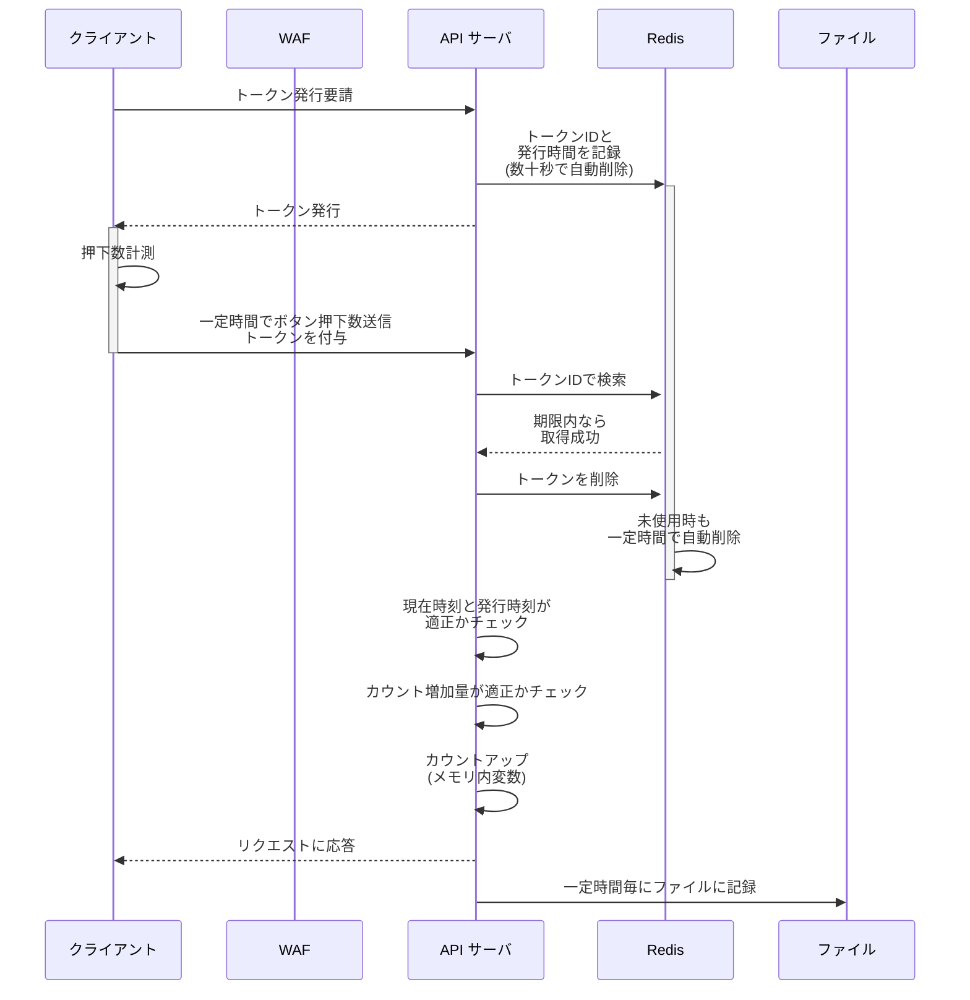

## 全ユーザがボタンを押した回数をゆるめにカウントしたい
こんな Web アプリを作りました。サカバンバスピスの顔をランダム生成します。

@[card](https://sacapis2026.faveo-systema.net)

好きな顔が出るまで連打したり、「サカバンバスピス」が出るまで連打したりして遊んでもらえます。
顔と対応するシード値を記録すればいつでも好きな顔を見返せますし、URL をシェアすれば特定の顔を誰かに見てもらえます。 こんな感じです...

@[card](https://sacapis2026.faveo-systema.net/?seed=2061770678)
@[card](https://sacapis2026.faveo-systema.net/?seed=1035158137)
@[card](https://sacapis2026.faveo-systema.net/?seed=1156240660)

この Web アプリには次の顔を生成するためのボタンが有るのですが、これが**全ユーザに何回押されたのか大まかに、でもちゃんと参考になる程度の正確さで記録したい**と考えました。

**この記事では、上記のサイトで割と有効だった手法の提案と紹介をします**。

## 紹介する方法：短命トークンによる時間幅制限+最大値制限
今回のアプリケーションの場合、以下のような要件があります：
- **連打されるボタンなので、1 回押される度にリクエストを飛ばしたくない**
- **短時間に何度もカウント増加リクエストを送られた場合に無効化したい**
- **カウント増加リクエストに極端な数を与えられた場合に無効化したい**

それらを踏まえ、下図の仕組みでカウントを行っています：


これらの設定値のギリギリを攻めて大量のリクエストを送られたりするとやっぱり破綻するのですが、WAF が間に入るので分かり易い攻撃はそこで弾いてもらう想定です。

## 実装の詳細

以下、上記の仕組みを実現するサンプルコードを紹介します。実際のプロダクション環境では数値を調整する必要があります。

### サーバー側（Hono + Redis）

#### トークン管理（tokenManager.ts）

```typescript
import { randomUUID } from "crypto";
import { redis } from "./redis";

const TOKEN_PREFIX = "count_token:";
const TOKEN_TTL = 30; // 30秒有効

// トークンを生成してRedisに保存
export const generateToken = async (): Promise<string | null> => {
  if (!redis) return null;

  const token = randomUUID();
  const key = `${TOKEN_PREFIX}${token}`;

  try {
    // TTL付きでトークンを保存（値は発行時刻のタイムスタンプ）
    await redis.setex(key, TOKEN_TTL, Date.now().toString());
    return token;
  } catch (error) {
    console.error("Failed to generate token:", error);
    return null;
  }
};

// トークンを検証して削除（使い捨て）
export const validateAndConsumeToken = async (
  token: string
): Promise<{ issuedAt: number } | null> => {
  if (!redis) {
    // 開発環境などではRedis無しでも動作
    return { issuedAt: Date.now() };
  }

  const key = `${TOKEN_PREFIX}${token}`;

  try {
    // トークンを取得してから削除（原子的に実行）
    const multi = redis.multi();
    multi.get(key);
    multi.del(key);
    const results = await multi.exec();

    if (!results || results.length !== 2) return null;

    const value = results[0][1] as string | null;
    const deleted = results[1][1] as number;

    if (deleted !== 1 || !value) return null;

    const issuedAt = parseInt(value, 10);
    return isNaN(issuedAt) ? null : { issuedAt };
  } catch (error) {
    console.error("Failed to validate token:", error);
    return null;
  }
};
```

ポイント：
- `randomUUID()` で推測困難なトークンを生成
- Redis の `SETEX` で TTL 付き保存により自動削除
- `MULTI` トランザクションで取得と削除を原子的に実行（トークンの使い回し防止）

#### カウント管理（countManager.ts）

```typescript
import { promises as fs } from "fs";
import path from "path";

const COUNT_FILE = path.join(process.cwd(), "data", "count.json");
const SAVE_INTERVAL_MS = 60 * 1000; // 1分毎にファイル保存

class CountManager {
  private count: number = 0;
  private saveTimer: NodeJS.Timeout | null = null;
  private isDirty: boolean = false;

  async initialize() {
    await this.load();
    this.startAutoSave();
    this.setupGracefulShutdown();
  }

  private async load() {
    try {
      const data = await fs.readFile(COUNT_FILE, "utf-8");
      const parsed = JSON.parse(data);
      this.count = parsed.total || 0;
      console.log(`Loaded count: ${this.count}`);
    } catch (error) {
      console.log("Count file not found, starting from 0");
      this.count = 0;
    }
  }

  async save() {
    if (!this.isDirty) return;

    try {
      const dir = path.dirname(COUNT_FILE);
      await fs.mkdir(dir, { recursive: true });
      await fs.writeFile(
        COUNT_FILE,
        JSON.stringify({ total: this.count }, null, 2),
        "utf-8"
      );
      this.isDirty = false;
      console.log(`Saved count: ${this.count}`);
    } catch (error) {
      console.error("Error saving count:", error);
    }
  }

  private startAutoSave() {
    this.saveTimer = setInterval(() => this.save(), SAVE_INTERVAL_MS);
  }

  private setupGracefulShutdown() {
    const shutdown = async () => {
      if (this.saveTimer) clearInterval(this.saveTimer);
      await this.save();
      process.exit(0);
    };
    process.on("SIGINT", shutdown);
    process.on("SIGTERM", shutdown);
  }

  increment(count: number = 1) {
    this.count += count;
    this.isDirty = true;
    return this.count;
  }

  getCount(): number {
    return this.count;
  }
}

export const countManager = new CountManager();
```

ポイント：
- メモリ内でカウントを保持（高速アクセス）
- 定期的にファイルに保存（永続化）
- `isDirty` フラグで不要な書き込みを回避
- SIGINT/SIGTERM でのグレースフルシャットダウン対応

#### APIエンドポイント（抜粋）

```typescript
import { Hono } from "hono";
import { countManager } from "./lib/countManager";
import { generateToken, validateAndConsumeToken } from "./lib/tokenManager";

const api = new Hono();

// トークン発行エンドポイント
api.post("/count/token", async (c) => {
  const token = await generateToken();
  if (!token) {
    return c.json({ token: "no-redis-dummy-token" });
  }
  return c.json({ token });
});

// カウント追加エンドポイント
api.post("/count", async (c) => {
  const body = await c.req.json<{ count?: number; token?: string }>();
  const incrementBy = body.count || 1;
  const token = body.token;

  if (!token) {
    return c.json({ error: "Token is required" }, 400);
  }

  // トークンを検証して消費
  const tokenInfo = await validateAndConsumeToken(token);
  if (!tokenInfo) {
    return c.json({ error: "Invalid or expired token" }, 403);
  }

  const now = Date.now();
  const elapsedMs = now - tokenInfo.issuedAt;

  // 5秒未満は不正として拒否（成功したように見せかける）
  if (elapsedMs < 5000) {
    console.warn(`Rejected: Token used too quickly (${elapsedMs}ms)`);
    // 実際にはカウントせず、加算したように見せかける
    return c.json({ total: countManager.getCount() + incrementBy });
  }

  // 15秒未満は警告ログを記録
  if (elapsedMs < 15000) {
    console.warn(`Warning: Token used quickly (${elapsedMs}ms)`);
  }

  // カウント数の妥当性チェック（100ms/個と仮定）
  const maxReasonableCount = Math.min(
    Math.floor(elapsedMs / 100),
    200 // 上限200個
  );

  if (incrementBy > maxReasonableCount) {
    console.warn(
      `Rejected: Count too high (${incrementBy} > ${maxReasonableCount})`
    );
    // 実際にはカウントせず、加算したように見せかける
    return c.json({ total: countManager.getCount() + incrementBy });
  }

  // カウントを加算
  const newCount = countManager.increment(incrementBy);
  return c.json({ total: newCount });
});
```

ポイント：
- トークン発行時刻との差分で時間制限を実現
- 不正リクエストにも成功レスポンスを返して攻撃者を欺く
- 経過時間からクリック数の上限を動的に算出

### クライアント側（React）

#### カウント追跡フック（useFaceCountTracker.ts）

```typescript
import { useRef } from 'react'

const SUBMIT_INTERVAL = 20000 // 20秒間隔

export const useFaceCountTracker = () => {
  const pendingCountRef = useRef(0)
  const tokenRef = useRef<string | null>(null)
  const timerIdRef = useRef<number | null>(null)

  // カウントをサーバに送信
  const submitWithToken = async () => {
    const count = pendingCountRef.current
    const token = tokenRef.current

    if (count === 0 || !token) return

    try {
      const response = await fetch('/api/count', {
        method: 'POST',
        headers: { 'Content-Type': 'application/json' },
        body: JSON.stringify({ token, count }),
      })

      if (response.ok) {
        // 送信成功したらリセット
        pendingCountRef.current = 0
        tokenRef.current = null
        console.log('Count submitted successfully')
      }
    } catch (error) {
      console.error('Failed to submit count:', error)
      tokenRef.current = null
    } finally {
      timerIdRef.current = null
    }
  }

  // カウントを増やす
  const incrementCount = async () => {
    const wasZero = pendingCountRef.current === 0
    pendingCountRef.current += 1

    // カウントが0→1になったらトークン取得とタイマー開始
    if (wasZero) {
      try {
        const response = await fetch('/api/count/token', {
          method: 'POST',
        })
        const data = await response.json()
        tokenRef.current = data.token

        // 既存のタイマーをクリア
        if (timerIdRef.current !== null) {
          clearTimeout(timerIdRef.current)
        }

        // 指定時間後に送信
        timerIdRef.current = window.setTimeout(() => {
          submitWithToken()
        }, SUBMIT_INTERVAL)
      } catch (error) {
        console.error('Failed to fetch token:', error)
        pendingCountRef.current = 0
      }
    }
  }

  return { incrementCount }
}
```

ポイント：
- `useRef` でクリック数とトークンを保持（再レンダリングの影響を受けない）
- 最初のクリック時にトークンを取得してタイマー開始
- 一定時間後に蓄積されたカウントをまとめて送信

#### 使用例

```typescript
function App() {
  const { incrementCount } = useFaceCountTracker()

  const handleButtonClick = () => {
    // ボタンクリック時にカウントを増やす
    incrementCount()
    // その他の処理...
  }

  return (
    <button onClick={handleButtonClick}>
      次の顔を生成
    </button>
  )
}
```

### 設定値の説明

このサンプルコードでは以下の設定値を使用しています：

| 設定項目 | 値 | 説明 |
|---------|-----|------|
| トークンTTL | 30秒 | トークンの有効期限 |
| クライアント送信間隔 | 20秒 | クライアントがカウントを蓄積する時間 |
| 最小経過時間 | 5秒 | これ未満だと不正として拒否 |
| 警告閾値 | 15秒 | これ未満だとログに警告を記録 |
| カウント計算基準 | 100ms/個 | 1クリック100msと仮定 |
| 最大カウント | 200個 | 1リクエストで受け付ける上限 |
| ファイル保存間隔 | 60秒 | メモリからファイルへの保存頻度 |

これらの値は運用しながら調整することをお勧めします。トークンTTLはクライアント送信間隔より長く設定し、余裕を持たせることが重要です。

## より素朴な実装のリスクと回避策
### クリック毎にリクエストを送信する方法
- 大量のリクエストが前提になり不正アクセスから防御しづらく、レートリミットがどこかで入ると計測自体ができなくなる
  - **→ クライアントからのリクエスト間隔はある程度抑えたい**

### 一定時間間隔でクリック回数を送信する方法
- リクエスト中に含まれる「いくつカウントを増やしたいか」のデータをいじられると破綻する
  - 「一定時間でカウントがいくつ増えたか」を完全にクライアントからの自己申告にすると厳しい
  - **→ 時間間隔に一定の制限を設けたい + 申告された回数が極端に多ければ制限したい**

...という考えを経て、上の方式を試すことにしました。

## 上手くいった点 / いかなかった点
- **上手くいった点**
  - Redis は一定時間で自動的に消えるエントリを簡単に用意できるので上記の動作を実現しやすいです、動作も非常に高速です
  - Hono による API サーバも高速に動作します
  - おかげさまで 10,000 カウントくらいまで来ましたが、特に問題なく動作しています
- **上手くいかなかった点**
  - 幾つか弱点がありそこを突かれると厳しいです、特にトークン発行部分に DDoS 攻撃されると Redis のエントリが飽和してしまうかも...
  - 上記の仕様のギリギリを攻めることで、許容される最大のカウントアップを繰り返し実際よりずっと多くクリックされた様に見せかけることが可能です
    - なので、カウント増加リクエストへのレスポンスは敢えて成功/失敗したのか分かりづらくしていますが、あまりに意味ないかもです...

## AI に聞いてみると...
AI に上記の様な要件のボタン押下回数カウント手法を尋ねると、幾つか異なる手法を提案してくれます。

> A) サーバ側を「冪等」にする（まずこれが最強）
> 
> ボタン押下ごとに、クライアントが
> 	•	clientId（localStorageにUUID）
> 	•	seq（単調増加の通し番号）
> 	•	eventId（UUIDでも可）
> 
> を送る。サーバは clientId ごとに「最後に受理した seq」を短期保存して、
> 	•	seq <= lastSeq は捨てる（再送・二重送信・リトライ耐性）
> 	•	seq == lastSeq + 1 は受理
> 	•	seq が飛んでたら「取りこぼし可能性」としてログ（許可はする/しないは運用で）
> 
> これだけで「連打」「通信の再送」「二重送信」の多くが綺麗に収まります。
> “早すぎるアクセス排除”みたいな時間判定より、まず冪等の方が安定して効きます。

これは `seq` を偽造したリクエストで簡単に突破できてしまいます...

AI が提案してくるレベルでは、全てにおいて上位互換のアイディアが見つからなかったので、割と良い線いっているのかもしれません?

## まとめ
何かシンプルに実現したいことがあっても、案外ただ一つの正解の実装はないのかも知れません。
そういう時は要件を深掘りしていって、適した手法を選ぶ/実験して調整することで、現実に合わせたベストな選択をしたいです。

とはいえ流石に「全ユーザがクリックした回数の合計」なんてものは非常によくあると思うので、ベストプラクティスの研究をもう少し続けてみます！

