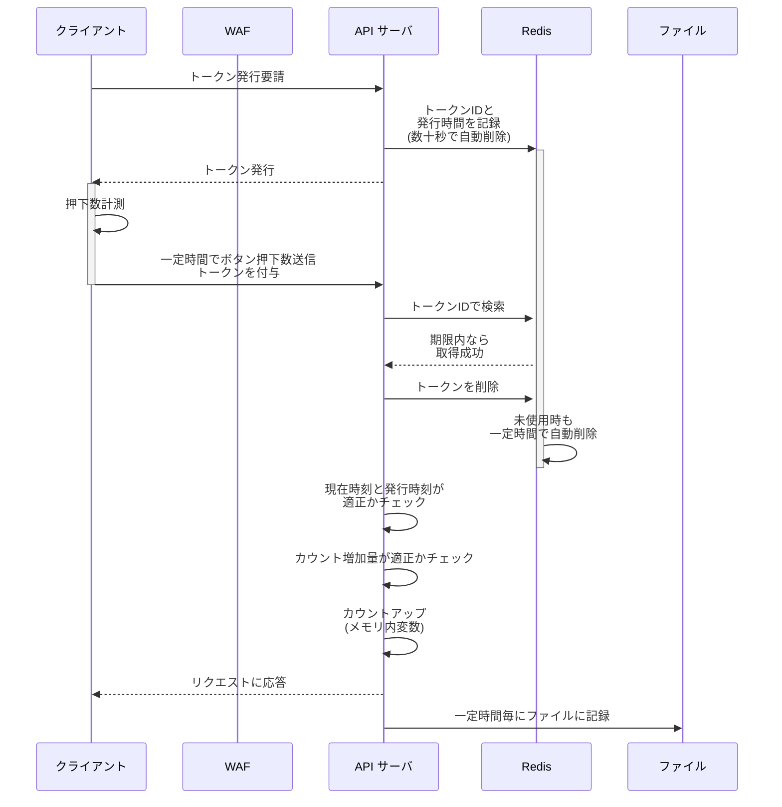

## 全ユーザがボタンを押した回数をゆるめにカウントしたい
こんな Web アプリを作りました。サカバンバスピスの顔をランダム生成します。

@[card](https://sacapis2026.faveo-systema.net)

好きな顔が出るまで連打したり、「サカバンバスピス」が出るまで連打したりして遊んでもらえます。
顔と対応するシード値を記録すればいつでも好きな顔を見返せますし、URL をシェアすれば特定の顔を誰かに見てもらえます。 こんな感じです...

@[card](https://sacapis2026.faveo-systema.net/?seed=2061770678)
@[card](https://sacapis2026.faveo-systema.net/?seed=1035158137)
@[card](https://sacapis2026.faveo-systema.net/?seed=1156240660)

この Web アプリには次の顔を生成するためのボタンが有るのですが、これが**全ユーザに何回押されたのか大まかに、でもちゃんと参考になる程度の正確さで記録したい**と考えました。

**この記事では、上記のサイトで割と有効だった手法の提案と紹介をします**。

## 紹介する方法：短命トークンによる時間幅制限+最大値制限
今回のアプリケーションの場合、以下のような要件があります：
- **連打されるボタンなので、1 回押される度にリクエストを飛ばしたくない**
- **短時間に何度もカウント増加リクエストを送られた場合に無効化したい**
- **カウント増加リクエストに極端な数を与えられた場合に無効化したい**

それらを踏まえ、下図の仕組みでカウントを行っています：

これらの設定値のギリギリを攻めて大量のリクエストを送られたりするとやっぱり破綻するのですが、WAF が間に入るので分かり易い攻撃はそこで弾いてもらう想定です。

## より素朴な実装のリスクと回避策
### クリック毎にリクエストを送信する方法
- 大量のリクエストが前提になり不正アクセスから防御しづらく、レートリミットがどこかで入ると計測自体ができなくなる
  - **→ クライアントからのリクエスト間隔はある程度抑えたい**

### 一定時間間隔でクリック回数を送信する方法
- リクエスト中に含まれる「いくつカウントを増やしたいか」のデータをいじられると破綻する
  - 「一定時間でカウントがいくつ増えたか」を完全にクライアントからの自己申告にすると厳しい
  - **→ 時間間隔に一定の制限を設けたい + 申告された回数が極端に多ければ制限したい**

...という考えを経て、上の方式を試すことにしました。

## 上手くいった点 / いかなかった点
- **上手くいった点**
  - Redis は一定時間で自動的に消えるエントリを簡単に用意できるので上記の動作を実現しやすいです、動作も非常に高速です
  - Hono による API サーバも高速に動作します
  - おかげさまで 10,000 カウントくらいまで来ましたが、特に問題なく動作しています
- **上手くいかなかった点**
  - 幾つか弱点がありそこを突かれると厳しいです、特にトークン発行部分に DDoS 攻撃されると Redis のエントリが飽和してしまうかも...
  - 上記の仕様のギリギリを攻めることで、許容される最大のカウントアップを繰り返し実際よりずっと多くクリックされた様に見せかけることが可能です
    - なので、カウント増加リクエストへのレスポンスは敢えて成功/失敗したのか分かりづらくしていますが、あまりに意味ないかもです...

## AI に聞いてみると...
AI に上記の様な要件のボタン押下回数カウント手法を尋ねると、幾つか異なる手法を提案してくれます。

> A) サーバ側を「冪等」にする（まずこれが最強）
> 
> ボタン押下ごとに、クライアントが
> 	•	clientId（localStorageにUUID）
> 	•	seq（単調増加の通し番号）
> 	•	eventId（UUIDでも可）
> 
> を送る。サーバは clientId ごとに「最後に受理した seq」を短期保存して、
> 	•	seq <= lastSeq は捨てる（再送・二重送信・リトライ耐性）
> 	•	seq == lastSeq + 1 は受理
> 	•	seq が飛んでたら「取りこぼし可能性」としてログ（許可はする/しないは運用で）
> 
> これだけで「連打」「通信の再送」「二重送信」の多くが綺麗に収まります。
> “早すぎるアクセス排除”みたいな時間判定より、まず冪等の方が安定して効きます。

これは `seq` を偽造したリクエストで簡単に突破できてしまいます...

AI が提案してくるレベルでは、全てにおいて上位互換のアイディアが見つからなかったので、割と良い線いっているのかもしれません?

## まとめ
何かシンプルに実現したいことがあっても、案外ただ一つの正解の実装はないのかも知れません。
そういう時は要件を深掘りしていって、適した手法を選ぶ/実験して調整することで、現実に合わせたベストな選択をしたいです。

とはいえ流石に「全ユーザがクリックした回数の合計」なんてものは非常によくあると思うので、ベストプラクティスの研究をもう少し続けてみます！

