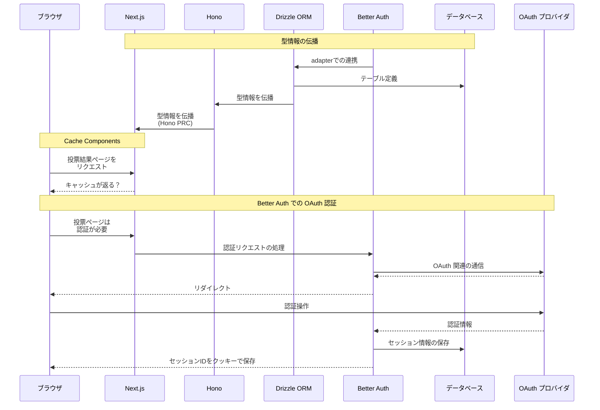

:::message
**下書きメモ（公開前に消します）**
- 「この技術が好きな人は、この技術も好き」といった傾向を分析できる Web 技術投票サイトを試作することを題材に、
  - Next.js v16 の [Cache Compnents](https://nextjs.org/docs/app/getting-started/cache-components)
  - [Drizzle ORM](https://orm.drizzle.team/) v1.0 beta 
  - [Better Auth](https://www.better-auth.com/) 

  ...の紹介と使用法を説明しつつ、要所にサンプルコード付きで紹介したいです

- 試作中 Web アプリのリポジトリは [ここ](https://github.com/Daiius/techmejiro) です
  - 記事公開時での上記 Web サイトの完成度に自信ないのでサイト自体の紹介は個人の記事にして、会社ブログでは個々の技術ポイントを紹介しようと考えています
  - 試作中 Web アプリの方向性自体は [個人ブログの記事](https://zenn.dev/daiius/articles/08c65823dae37dI) に近く、投票対象がキャラクターから Web 技術になるくらいの差です

:::

# 気になる技術を色々使って Web アプリを作ってみます
変化の早い Web 技術、新技術や新機能を試す前に次の更新が出てしまいそう...なので、**「いっそフルスタックで何か作ったら新しい技術に触る機会ができるのでは？」** と考えました。

## 題材：「この技術が好きな人は、この技術も好き」が分析できる Web 技術アンケートサイト
個人開発で似た概念のものを作ったのですが、**社内で Web 技術についてアンケートや分析をしたいというモチベーションがある**ので、題材として丁度良さそうです。
[State of JavaScript](https://stateofjs.com/ja-JP) など既に類似するものはありますが、上記の様な関係性の分析はどうやら公開されておらず、手元で分析できたら面白そうです！

## 気になる技術スタック
- [**Next.js v16**](https://nextjs.org/blog/next-16)
  - [Cache Components](https://nextjs.org/docs/app/getting-started/cache-components) が気になります、投票・分析サイトでの使い所を考えてみます
   
  @[card](https://nextjs.org)

- [**Better Auth**](https://www.better-auth.com/)
  - Auth.js 使っていましたが、[こんなお知らせ](https://www.better-auth.com/blog/authjs-joins-better-auth) があったりしたので気になっていました
  - 充実した機能を持つ認証用ライブラリで、「誰が投票しているか」把握するするため使用します

  @[card](https://www.better-auth.com/)

- [**Drizzle ORM**](https://orm.drizzle.team/)
  - アプリケーションとデータベースを繋ぐ ORM (Object Relational Mapper) の 1 つです
  - テーブル設計から設定ファイルまで全部 TypeScript、もちろん型が付きます
  - v1.0 がもうすぐ出ます...！まだ beta ですが試してみます！

  @[card](https://orm.drizzle.team/)

今回は紹介しませんが、次の技術も使用します
- [Hono](https://hono.dev/)
  - 軽量な、Web 標準を重視するサーバサイド用フレームワークです
  - [RPC 機能](://hono.dev/docs/guides/rpc#rpc) で DB → FE まで型情報の伝播が可能です
  - Next.js から直接DBアクセスする構成もありですが、柔軟性や個人的な環境の制約からバックエンドを作る際、よく使用します
- もちろんデータベースもありますが、今回の主役ではないので省略です

正確な表現が難しく、省略しているところがありますが、この様に動作します

:::message
下書きメモ: OAuth 認証に関係するところ、できるだけ正確に書きたい
:::



## 以下はまだ整理していない部分

## Drizzle ORM v1.0 beta 
v1.0 beta では relation 定義の方法がちょっと変わっています
```typescript
// Drizzle ORM v1.0 beta の relations 定義
export const relations = defineRelations(
  { user, account, session },
  (r) => ({
    user: {
      sessions: r.many.session(),
      accounts: r.many.account(),
      votes: r.many.votes(),
    },
    session: {
      user: r.one.user({
        from: r.session.userId,
        to: r.user.id,
      }),
    },
    account: {
      user: r.one.user({
        from: r.account.userId,
        to: r.user.id,
      }),
    },
  )}
);
```
:::details 以前の relations の書き方はこう
```typescript
// Drizzle ORM v0.x の relations 定義
export const userRelations = relations(user, ({ many }) => ({
  sessions: many(session),
  accounts: many(account),
}));

export const sessionRelations = relations(session, ({ one }) => ({
  user: one(user, {
    fields: [session.userId],
    references: [user.id],
  }),
}));

export const accountRelations = relations(account, ({ one }) => ({
  user: one(user, {
    fields: [account.userId],
    references: [user.id],
  }),
}));
```
:::

relations を使うと、テーブル結合の具体的な手続きを毎回意識せずに関連したデータを自動で取ってくる query 機能が使えます。

例えば投票データは userId, techId, impressionId の組ですが、 データ取得時に techId に紐づいた tech の情報、impressionId に紐づいた impression も情報も一緒に欲しい、みたいな時にこんな書き方ができます
```typescript
// Drizzle ORM query の例
await db.query.votes.findMany({
  where: { userId: { eq: userId } }, // ← この部分もv1.0βで変わっています
  with: {
    tech: true,
    impression: true,
  }
});
```
:::details SQLを直接書くのに近い別の方法...
柔軟ですがテーブル結合方法は自分で考え指定します。
```typescript
// Drizzle ORM select の例
await db.select.from(votes).where(eq(votes.userId, userId))
  .leftJoin(techs, eq(votes.techId, techs.id))
  .leftJoin(impressions, eq(votes.impressionId, impressions.id));
```
:::

今はスキーマ定義全体に関連する 1 つの relations を指定する方法になっているみたいです。
```typescript
// db/index.ts
import { relations } from "./schema";
export const db = drizzle({ client, relations, mode: "default", });
```

relations 定義の場所を複数ファイルに分割する場合、どこかで 1 つにまとめる必要があるので、[defineRelationsPart](https://orm.drizzle.team/docs/latest-releases/drizzle-orm-v1beta2#relational-query-parts) 関数というのも用意されています！

:::details 以前の relations 使用方法
以前はこんな感じで schema に含まれる複数の relations をまとめて渡していました。
```typescript
// db/index.ts 
import * as schema from "db/schema";
const db = drizzle(connection, { schema, mode: "default" });
```
:::

## Next.js Cach Components

- "use cache" と "use cache: private" の挙動の違いは？
  - 全体的な投票分析結果は "use cache"、ユーザそれぞれの投票結果は "use cache: private" か?

## Better Auth

設定ファイルや処理がまとまっていると感じます！ Auth.js と近い感覚で扱えます。

Google と GitHub の OAuth 認証を設定してみています。
```typescript
// better-auth.config.ts
import { betterAuth } from "better-auth";
import { drizzleAdapter } from "better-auth/adapters/drizzle";
import { db } from "db";

export const auth = betterAuth({
  database: drizzleAdapter(db, { provider: "postgres" }),
  socialProviders: {
    google: {
      clientId: process.env.GOOGLE_CLIENT_ID!,
      clientSecret: process.env.GOOGLE_CLIENT_SECRET!,
    },
    github: {
      clientId: process.env.GITHUB_CLIENT_ID!,
      clientSecret: process.env.GITHUB_CLIENT_SECRET!,
      scope: ["read:user", "user:email"],
    },
  },
});
```

上記の設定ファイルは、動作時だけでなくセッション管理用スキーマ生成にも使用されます。
```bash
# 上記設定ファイル + このコマンドで Drizzle ORM のスキーマが生成されます
pnpm dlx @better-auth/cli@latest generate
```

Hono に組み込む際はこんな感じです、シンプル。
```typescript
// Hono + Better Auth の重要部分抜粋
import { app } from "Hono";
import { auth } from "better-auth.config";

const app = new Hono();

app.all("/api/auth/*", async c => {
  return await auth(c.req.raw);
})
```
