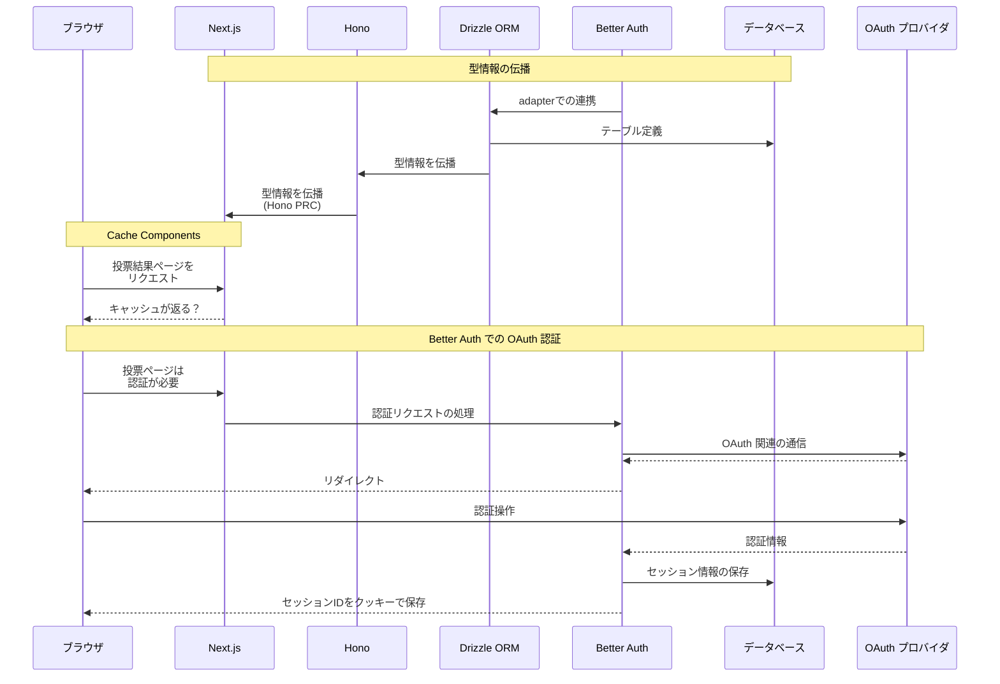

:::message
**下書きメモ（公開前に消します）**
- 「この技術が好きな人は、この技術も好き」といった傾向を分析できる Web 技術投票サイトを試作することを題材に、
  - Next.js v16 の [Cache Compnents](https://nextjs.org/docs/app/getting-started/cache-components)
  - [Drizzle ORM](https://orm.drizzle.team/) v1.0 beta 
  - [Better Auth](https://www.better-auth.com/) 

  ...の紹介と使用法を説明しつつ、要所にサンプルコード付きで紹介したいです

- 試作中 Web アプリのリポジトリは [ここ](https://github.com/Daiius/techmejiro) です
  - 記事公開時での上記 Web サイトの完成度に自信ないのでサイト自体の紹介は別の記事にして、会社ブログでは個々の技術ポイントを紹介しようと考えています

:::

# 気になる技術を色々使って Web アプリを作っています
変化の早い Web 技術、新技術や新機能を試す前に次の更新が出てしまいそう...なので、**「いっそフルスタックで何か作ったら新しい技術に触る機会ができるのでは？」** と考えました。

# 題材：「この技術が好きな人は、この技術も好き」が分析できる Web 技術アンケートサイト
個人開発で似た概念のものを作ったのですが、**社内で Web 技術についてアンケートや分析をしたいというモチベーションがある**ので、題材として丁度良さそうです。
[State of JavaScript](https://stateofjs.com/ja-JP) など既に類似するものはありますが、**上記の様な関係性の分析はどうやら公開されていない**ので、手元で分析できたら面白そうです！

:::message
本記事は技術調査の内容に留め、実際に投票サイトを動く状態まで持っていくのは別記事にしたいと思います。 ちゃんと動作するまではもう少し掛かりそうです...
:::

# 気になる技術
- [**Next.js v16**](https://nextjs.org/blog/next-16)
  - [Cache Components](https://nextjs.org/docs/app/getting-started/cache-components) が気になります、投票・分析サイトでの使い所を考えてみます
   
  @[card](https://nextjs.org)

  @[card](https://nextjs.org/docs/app/getting-started/cache-components)

- [**Better Auth**](https://www.better-auth.com/)
  - Auth.js 使っていましたが、[こんなお知らせ](https://www.better-auth.com/blog/authjs-joins-better-auth) があったりしたので気になっていました
  - 充実した機能を持つ認証用ライブラリで、「誰が投票しているか」把握するするため使用します

  @[card](https://www.better-auth.com/)

- [**Drizzle ORM**](https://orm.drizzle.team/)
  - アプリケーションとデータベースを繋ぐ ORM (Object Relational Mapper) の 1 つです
  - テーブル設計から設定ファイルまで全部 TypeScript、もちろん型が付きます
  - v1.0 がもうすぐ出ます...！まだ beta ですが試してみます！

  @[card](https://orm.drizzle.team/)


# 気になる技術の調査・感想 まとめ
- **Cache Components**
  - `use cache: privatre` は、 **「同一リクエスト内で use cache: private 指定されたある関数が同じ条件で複数回呼ばれる場合、最初の実行結果がキャッシュされ後の呼び出しではその結果が返される。リクエストを跨いだキャッシュはしない」** という挙動になるみたいです
  - `use cache` 系のディレクティブは便利ですが独特な感じがするので、同等の機能が他のフレームワークでどう実現されるか等、今後の幅広いフロントエンドフレームワークの動向に一層興味を持っていきたいです
- **Drizzle ORM v1.0β**
  - 以前よりパッと見で分かり易い書き方になったり、少ない import で表現できるのが良い感じがします！
  - ずっと deprecated な依存関係を抱えていた部分も解消されています
- **Better Auth**
  - 後発であることもあって整理された使用感です！Drizzle ORM や Hono との連携も自然にできます
    - 厳密には Drizzle ORM v1.0β 向けのスキーマ生成はできず一部修正しましたが問題ないレベルです、Drizzle ORM v1.0 の正式リリース後すぐ対応されるでしょう

# 気になる技術の調査・感想 詳細
## Next.js Cach Components

公式のサンプルや説明からは、
- **"use cache" が向いていそうなもの**
  - 投票全体の分析結果で、全ユーザに共通するキャッシュを設定できるもの
- **"use cache: private" が向いていそうなもの**
  - ...ユーザ毎の投票データ...？ ちょっと分からないですね...

> The 'use cache: private' directive works just like use cache, but allows you to use runtime APIs like cookies, headers, or search params.

とは[公式ドキュメント](https://nextjs.org/docs/app/api-reference/directives/use-cache-private)に書いてあるのですが、 "use cache: private" は結局どんな挙動をするのかよく分からなかったので、実験しつつソースコードを調査してみました。

:::details "use cache: private" 有りと無しの関数を、同一リクエスト中で複数回呼ぶ実験コード
```typescript
// src/app/test-cache-private/page.tsx
import { Suspense } from 'react';
import { cookies } from 'next/headers';
import { cacheLife } from 'next/cache';

// カウンターを外部ファイルで管理
let callCountWithCache = 0;
let callCountWithoutCache = 0;

// use cache: private を使った関数
async function fetchDataWithPrivateCache(id: string) {
  'use cache: private';
  cacheLife({ stale: 60 });

  // クッキーを使用（use cache: privateでのみ可能）
  const sessionId = (await cookies()).get('session-id')?.value || 'guest';

  // 実行回数をカウント
  callCountWithCache++;
  const timestamp = new Date().toISOString();

  console.log(`[WITH CACHE] fetchDataWithPrivateCache called for id=${id}, session=${sessionId}, count=${callCountWithCache}, time=${timestamp}`);

  // 重い処理をシミュレート
  await new Promise(resolve => setTimeout(resolve, 100));

  return {
    id,
    sessionId,
    callCount: callCountWithCache,
    timestamp,
    cached: true,
  };
}

// use cache: private を使わない通常の関数
async function fetchDataWithoutCache(id: string) {
  const sessionId = (await cookies()).get('session-id')?.value || 'guest';

  // 実行回数をカウント
  callCountWithoutCache++;
  const timestamp = new Date().toISOString();

  console.log(`[WITHOUT CACHE] fetchDataWithoutCache called for id=${id}, session=${sessionId}, count=${callCountWithoutCache}, time=${timestamp}`);

  // 重い処理をシミュレート
  await new Promise(resolve => setTimeout(resolve, 100));

  return {
    id,
    sessionId,
    callCount: callCountWithoutCache,
    timestamp,
    cached: false,
  };
}

// use cache: privateを使ったテストコンポーネント
async function TestWithCache() {
  console.log('\n=== Testing with cache ===\n');

  // use cache: privateを使った関数を同じIDで3回呼び出し
  const resultWithCache1 = await fetchDataWithPrivateCache('test-1');
  const resultWithCache2 = await fetchDataWithPrivateCache('test-1');
  const resultWithCache3 = await fetchDataWithPrivateCache('test-1');

  return (
    <section className="mb-10 bg-info p-5">
      <h2>use cache: private を使用した場合</h2>
      <p><strong>期待される挙動：</strong> 同一リクエスト内でキャッシュされ、実際の処理は1回のみ実行される</p>
      <div>
        <h3>1回目の呼び出し:</h3>
        <pre>{JSON.stringify(resultWithCache1, null, 2)}</pre>
      </div>
      <div>
        <h3>2回目の呼び出し:</h3>
        <pre>{JSON.stringify(resultWithCache2, null, 2)}</pre>
      </div>
      <div>
        <h3>3回目の呼び出し:</h3>
        <pre>{JSON.stringify(resultWithCache3, null, 2)}</pre>
      </div>
      <div className="bg-base-100 p-4 mt-4">
        <strong>結果分析:</strong>
        {resultWithCache1.callCount === resultWithCache2.callCount &&
         resultWithCache2.callCount === resultWithCache3.callCount ? (
          <p className="text-success">✓ キャッシュが効いています！callCountが全て同じです（{resultWithCache1.callCount}回）</p>
        ) : (
          <p className="text-warning">⚠ キャッシュが効いていない可能性があります。callCountが異なります。</p>
        )}
      </div>
    </section>
  );
}

// use cache: privateを使わないテストコンポーネント
async function TestWithoutCache() {
  console.log('\n=== Testing without cache ===\n');

  // use cache: privateを使わない関数を同じIDで3回呼び出し
  const resultWithoutCache1 = await fetchDataWithoutCache('test-1');
  const resultWithoutCache2 = await fetchDataWithoutCache('test-1');
  const resultWithoutCache3 = await fetchDataWithoutCache('test-1');

  return (
    <section className="mb-10 bg-error/10 p-5">
      <h2>use cache: private を使用しない場合</h2>
      <p><strong>期待される挙動：</strong> キャッシュされず、毎回実際の処理が実行される</p>
      <div>
        <h3>1回目の呼び出し:</h3>
        <pre>{JSON.stringify(resultWithoutCache1, null, 2)}</pre>
      </div>
      <div>
        <h3>2回目の呼び出し:</h3>
        <pre>{JSON.stringify(resultWithoutCache2, null, 2)}</pre>
      </div>
      <div>
        <h3>3回目の呼び出し:</h3>
        <pre>{JSON.stringify(resultWithoutCache3, null, 2)}</pre>
      </div>
      <div className="bg-base-100 p-4 mt-4">
        <strong>結果分析:</strong>
        {resultWithoutCache1.callCount !== resultWithoutCache2.callCount &&
         resultWithoutCache2.callCount !== resultWithoutCache3.callCount ? (
          <p className="text-success">✓ キャッシュなしで毎回実行されています！callCountが増加しています（{resultWithoutCache1.callCount}, {resultWithoutCache2.callCount}, {resultWithoutCache3.callCount}）</p>
        ) : (
          <p className="text-warning">⚠ 予期しない挙動です。callCountが変化していません。</p>
        )}
      </div>
    </section>
  );
}

export default async function TestCachePrivatePage() {
  console.log('\n=== Starting test page render ===\n');

  // リセット
  callCountWithCache = 0;
  callCountWithoutCache = 0;

  return (
    <div className="p-5 font-mono">
      <h1>use cache: private 挙動テスト</h1>

      <section className="mb-10">
        <h2>テスト概要</h2>
        <p>同一リクエスト内で、同じID（&quot;test-1&quot;）で関数を3回呼び出した際の挙動を比較します。</p>
      </section>

      <Suspense fallback={<div className="p-5 bg-info">Loading cache test...</div>}>
        <TestWithCache />
      </Suspense>

      <Suspense fallback={<div className="p-5 bg-error/10">Loading non-cache test...</div>}>
        <TestWithoutCache />
      </Suspense>

      <section className="bg-base-200 p-5">
        <h2>まとめ</h2>
        <p>ブラウザのコンソールとターミナルのログも確認してください。</p>
        <p>ページをリロードすると新しいリクエストとなり、カウンターがリセットされます。</p>
      </section>
    </div>
  );
}
```
:::


試してみた結果はこんな感じです:


「**use cache: private が指定された関数は、同一リクエスト内で複数回呼び出されると、最初の結果がキャッシュされ以降の呼び出しはその内容が返される**」 という性質が見て取れます。

また、複数回リロードしたりして色々試してみると、**リクエストを跨いだキャッシュがされない**様にも見えます。

この挙動の裏付けになりそうなソースコードは [use-cache-wrapper.ts](https://github.com/vercel/next.js/blob/v16.0.10/packages/next/src/server/use-cache/use-cache-wrapper.ts) で、
> // Private caches are currently only stored in the Resume Data Cache (RDC),
> //  and not in cache handlers

という記述や、RDC はリクエスト毎に新規作成されるオブジェクトであることあたりが関連していそうです。

ということは、同一リクエスト内で複数回呼ばれる関数に対して "use cache: private" を指定することはパフォーマンス面で有利に出来る傾向が有りそうです。

## Drizzle ORM v1.0 beta 
v1.0 beta では relation 定義の方法がちょっと変わっています
```typescript
// Drizzle ORM v1.0 beta の relations 定義
export const relations = defineRelations(
  { user, account, session },
  (r) => ({
    user: {
      sessions: r.many.session(),
      accounts: r.many.account(),
      votes: r.many.votes(),
    },
    session: {
      user: r.one.user({
        from: r.session.userId,
        to: r.user.id,
      }),
    },
    account: {
      user: r.one.user({
        from: r.account.userId,
        to: r.user.id,
      }),
    },
  )}
);
```
:::details 以前の relations の書き方はこう
```typescript
// Drizzle ORM v0.x の relations 定義
export const userRelations = relations(user, ({ many }) => ({
  sessions: many(session),
  accounts: many(account),
}));

export const sessionRelations = relations(session, ({ one }) => ({
  user: one(user, {
    fields: [session.userId],
    references: [user.id],
  }),
}));

export const accountRelations = relations(account, ({ one }) => ({
  user: one(user, {
    fields: [account.userId],
    references: [user.id],
  }),
}));
```
:::

relations を使うと、テーブル結合の具体的な手続きを毎回意識せずに関連したデータを自動で取ってくる query 機能が使えます。

例えば投票データは userId, techId, impressionId の組ですが、 データ取得時に techId に紐づいた tech の情報、impressionId に紐づいた impression も情報も一緒に欲しい、みたいな時にこんな書き方ができます
```typescript
// Drizzle ORM query の例
await db.query.votes.findMany({
  where: { userId: { eq: userId } }, // ← この部分もv1.0βで変わっています
  with: {
    tech: true,
    impression: true,
  }
});
```
:::details SQLを直接書くのに近い別の方法...
柔軟ですが、テーブル結合方法は毎回自分で考え指定する必要が有ります。
```typescript
// Drizzle ORM select の例
await db.select.from(votes).where(eq(votes.userId, userId))
  .leftJoin(techs, eq(votes.techId, techs.id))
  .leftJoin(impressions, eq(votes.impressionId, impressions.id));
```
:::

今はスキーマ定義全体に関連する 1 つの relations を指定する方法になっているみたいです。
```typescript
// db/index.ts
import { relations } from "./schema";
export const db = drizzle({ client, relations, mode: "default", });
```

relations 定義の場所を複数ファイルに分割する場合、どこかで 1 つにまとめる必要があるので、[defineRelationsPart](https://orm.drizzle.team/docs/latest-releases/drizzle-orm-v1beta2#relational-query-parts) 関数というのも用意されています！

:::details 以前の relations 使用方法
以前はこんな感じで schema に含まれる複数の relations をまとめて渡していました。
```typescript
// db/index.ts 
import * as schema from "db/schema";
const db = drizzle(connection, { schema, mode: "default" });
```
:::

全体的に記述の方法がスマートになっていると感じます！


## Better Auth

設定ファイルや処理がまとまっていると感じます！ Auth.js と近い感覚で扱えます。

Google と GitHub の OAuth 認証を設定してみています。
```typescript
// better-auth.config.ts
import { betterAuth } from "better-auth";
import { drizzleAdapter } from "better-auth/adapters/drizzle";
import { db } from "db";

export const auth = betterAuth({
  database: drizzleAdapter(db, { provider: "postgres" }),
  socialProviders: {
    google: {
      clientId: process.env.GOOGLE_CLIENT_ID!,
      clientSecret: process.env.GOOGLE_CLIENT_SECRET!,
    },
    github: {
      clientId: process.env.GITHUB_CLIENT_ID!,
      clientSecret: process.env.GITHUB_CLIENT_SECRET!,
      scope: ["read:user", "user:email"],
    },
  },
});
```

上記の設定ファイルは、動作時だけでなくセッション管理用スキーマ生成にも使用されます。
```bash
# 上記設定ファイル + このコマンドで Drizzle ORM のスキーマが生成されます
pnpm dlx @better-auth/cli@latest generate
```

例えば Hono に組み込む際はこんな感じです、シンプル。
```typescript
// Hono + Better Auth の重要部分抜粋
import { app } from "Hono";
import { auth } from "better-auth.config";

const app = new Hono();

app.all("/api/auth/*", async c => {
  return await auth.handler(c.req.raw);
})
```

Next.js に組み込むサンプルも[ドキュメント](https://www.better-auth.com/docs/examples/next-js)に有りますね！
```typescript
import { toNextJsHandler } from "better-auth/next-js";
import { auth } from "@/lib/auth";

export const { GET, POST } = toNextJsHandler(auth);
```

実際に OAuth プロバイダの設定を行って動作するところまでスムーズに進みました！使い易いと感じます！

# 全体の感想
気になる技術と作りたいものが比較的マッチしていたためか、個々の技術調査に留まらず、複数組み合わせた際の相性の良いところ・悪いところについても考える機会が得られました。
ピントの定まらないごった煮感のある内容になってはしまいましたが、技術調査の方向性としては有りなのかもしれません。

この記事で扱っていた内容のどれか 1 つでも、皆さんにとっても気になるポイントになっていたら幸いです！

# 公開前に削除する、メモ書きゾーン
:::message
この章以降は、本番公開前に削除します
:::

::::details 全体的な動作のイメージ
正確な表現が難しく、省略しているところがありますが、この様に動作します

:::message
下書きメモ: OAuth 認証に関係するところ、できるだけ正確に書きたい
:::


::::

次の技術も使用します:
- [Hono](https://hono.dev/)
  - 軽量な、Web 標準を重視するサーバサイド用フレームワークです
  - [RPC 機能](://hono.dev/docs/guides/rpc#rpc) で DB → FE まで型情報の伝播が可能です
- もちろんデータベースも使用しますが、今回は省略です

