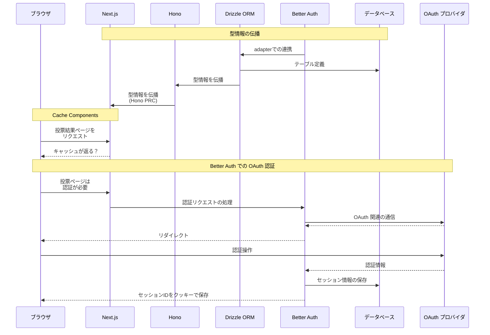
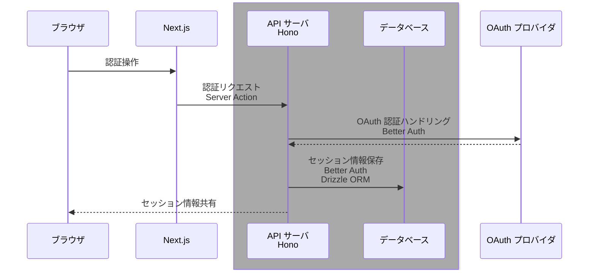

:::message
**下書きメモ（公開前に消します）**
- 「この技術が好きな人は、この技術も好き」といった傾向を分析できる Web 技術投票サイトを試作することを題材に、
  - Next.js v16 の [Cache Compnents](https://nextjs.org/docs/app/getting-started/cache-components)
  - [Drizzle ORM](https://orm.drizzle.team/) v1.0 beta 
  - [Better Auth](https://www.better-auth.com/) 

  ...の紹介と使用法を説明しつつ、要所にサンプルコード付きで紹介したいです

- 試作中 Web アプリのリポジトリは [ここ](https://github.com/Daiius/techmejiro) です
  - 記事公開時での上記 Web サイトの完成度に自信ないのでサイト自体の紹介は個人の記事にして、会社ブログでは個々の技術ポイントを紹介しようと考えています
  - 試作中 Web アプリの方向性自体は [個人ブログの記事](https://zenn.dev/daiius/articles/08c65823dae37dI) に近く、投票対象がキャラクターから Web 技術になるくらいの差です

:::

# 気になる技術を色々使って Web アプリを作ってみます
変化の早い Web 技術、新技術や新機能を試す前に次の更新が出てしまいそう...なので、**「いっそフルスタックで何か作ったら新しい技術に触る機会ができるのでは？」** と考えました。

## 題材：「この技術が好きな人は、この技術も好き」が分析できる Web 技術アンケートサイト
個人開発で似た概念のものを作ったのですが、**社内で Web 技術についてアンケートや分析をしたいというモチベーションがある**ので、題材として丁度良さそうです。
[State of JavaScript](https://stateofjs.com/ja-JP) など既に類似するものはありますが、上記の様な関係性の分析はどうやら公開されておらず、手元で分析できたら面白そうです！

## 気になる技術スタック
- [**Next.js v16**](https://nextjs.org/blog/next-16)
  - [Cache Components](https://nextjs.org/docs/app/getting-started/cache-components) が気になります、投票・分析サイトでの使い所を考えてみます
   
  @[card](https://nextjs.org)

- [**Better Auth**](https://www.better-auth.com/)
  - Auth.js 使っていましたが、[こんなお知らせ](https://www.better-auth.com/blog/authjs-joins-better-auth) があったりしたので気になっていました
  - 充実した機能を持つ認証用ライブラリで、「誰が投票しているか」把握するするため使用します

  @[card](https://www.better-auth.com/)

- [**Drizzle ORM**](https://orm.drizzle.team/)
  - アプリケーションとデータベースを繋ぐ ORM (Object Relational Mapper) の 1 つです
  - テーブル設計から設定ファイルまで全部 TypeScript、もちろん型が付きます
  - v1.0 がもうすぐ出ます...！まだ beta ですが試してみます！

  @[card](https://orm.drizzle.team/)

今回は紹介しませんが、次の技術も使用します
- [Hono](https://hono.dev/)
  - 軽量な、Web 標準を重視するサーバサイド用フレームワークです
  - [RPC 機能](://hono.dev/docs/guides/rpc#rpc) で DB → FE まで型情報の伝播が可能です
  - Next.js から直接DBアクセスする構成もありですが、柔軟性や個人的な環境の制約からバックエンドを作る際、よく使用します
- もちろんデータベースもありますが、今回の主役ではないので省略です

正確な表現が難しく、省略しているところがありますが、この様に動作します

:::message
下書きメモ: OAuth 認証に関係するところ、できるだけ正確に書きたい
:::

## 以下はまだ整理していない部分

## Drizzle ORM v1.0 beta

- db.query するとき where 部分に drizzle-orm の import が必要無くなったのは嬉しい
- relations の optional: false が動いていないっぽい

Drizzle ORM v1.0 では relation 定義の方法が変わっていて、Better Auth 生成部分を以下のように書き換える必要がありました。

https://github.com/Daiius/techmejiro/blob/8e860f9ea04eea498eccf4053b5bdcb4e0145fd6/db/db/schema.ts#L78-L97

## Next.js Cach Components

- "use cache" と "use cache: private" の挙動の違いは？
  - 全体的な投票分析結果は "use cache"、ユーザそれぞれの投票結果は "use cache: private" か?

## Better Auth

Drizzle ORM との連携で、次の様なテーブルが生成されます。他に session, account テーブルができます

https://github.com/Daiius/techmejiro/blob/8e860f9ea04eea498eccf4053b5bdcb4e0145fd6/db/db/auth-schema.ts#L10-L21

## メモ
認証の流れ

