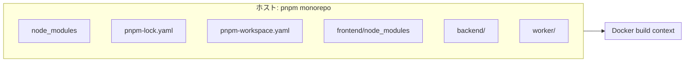
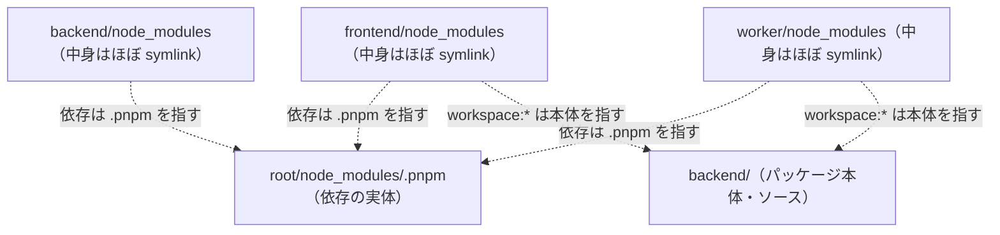
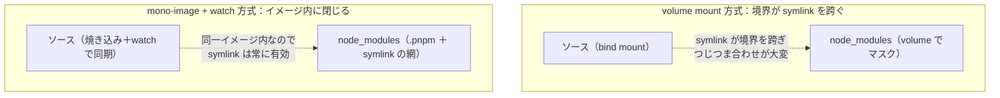

## はじめに

pnpm モノレポ + Docker Compose 開発環境を、個人開発の Web アプリ向けに構成しています。
frontend / backend / db を 1 コマンドで起動できるのは快適ですが、構成は試行錯誤しています。

長く使っていたのは、ソースコードを **volume mount** でコンテナに渡す方式です。
これが地味に不安定で、**「ソースも `node_modules` も開発用イメージに焼き込み、変更分だけ `docker compose watch` で送り込む」**方式へ乗り換えています。
鍵は、pnpm workspace 全体を含み全サービスで共有する、単一の開発イメージです。monorepo をそのまま1つのイメージにしたものなので、本記事ではこれを **mono-image**^[造語です。説明的に言えば "shared workspace image"。monorepo＝単一リポジトリに独立した複数パッケージ、の相似形で、mono-image＝単一イメージを独立した複数コンテナで共有、の意図です。モノリス（単一の実行単位）とは別物で、実行はサービスごとに分かれたままです。]と呼び、これを作る `Dockerfile.dev` と差分を届ける watch を合わせて **mono-image + watch 方式** と呼ぶことにします。どちらが欠けても成立しない、対の構成です。


本記事は「何が良くなって、何を引き換えにしたのか」を整理しています。
細部は今も迷っていますが現在の構成を示しつつ、before / after を対比してみます。


## 現在の構成：mono-image + watch 方式

先に、いま落ち着いている構成をそのまま示します。



`docker compose watch`（Compose v2.22 以降）は、ホスト側のファイル変更を検知して、コンテナに対して **sync（同期）/ rebuild（再ビルド）/ sync+restart（同期して再起動）** のいずれかを実行してくれる機能です。これを使うと、発想を「ソースを mount する」から「**ソースはイメージに焼き込み、変更分だけ watch で送り込む**」に切り替えられます。焼き込む側の `Dockerfile.dev` と送り込む側の watch 設定を、順に見ていきます。

### なぜ pnpm monorepo だと volume mount が辛いのか

「ソースを焼き込む」方向が嬉しい理由は、pnpm の `node_modules` の作りにあります。

pnpm の `node_modules` は、npm/yarn のような「実体ファイルがフラットに並んだ1ディレクトリ」ではありません。実体はワークスペースのルートの `node_modules/.pnpm` にだけ存在し、各パッケージの `node_modules` の中身はそこを指す **symlink の集まり**です（`workspace:*` 依存は相手パッケージ本体への symlink）。



つまり `node_modules` は「ディレクトリ」というより、ルートの実体置き場と各パッケージを結ぶ **symlink の網**です。

これを volume mount で再現しようとすると、途端に苦しくなります。`node_modules` だけを volume でマスクする定番ハックを pnpm でやると、**マスクすべき階層が複数になる**うえ、symlink の参照先がコンテナ側のレイアウトと食い違って**リンクが切れやすい**のです。（symlink をやめてフラット化する `node-linker: hoisted` という逃げ道もありますが、pnpm 本来の利点を手放すことになります。）

### bind mount をやめて Dockerfile.dev に COPY する

まず、開発用の `Dockerfile.dev` を1枚だけ用意し、ソースを `COPY` でイメージに含めてしまいます。（`.dev` は本番用 `Dockerfile` と区別するための命名で、必須ではありません。multi-stage の `dev` ターゲットとして本番用と1枚にまとめる手もあります。）

```dockerfile:Dockerfile.dev
FROM node:22-slim
WORKDIR /workspace
RUN corepack enable && corepack prepare pnpm@10.33.2 --activate

# 依存定義だけ先に COPY して install 層をキャッシュする。
# ソースを変えてもこの層は無効化されない。
COPY package.json pnpm-lock.yaml pnpm-workspace.yaml ./
COPY backend/package.json ./backend/
COPY frontend/package.json ./frontend/
COPY worker/package.json ./worker/

# pnpm の store を BuildKit のキャッシュに載せ、再ビルド時の再ダウンロードを避ける
RUN --mount=type=cache,target=/root/.local/share/pnpm/store \
    pnpm install --frozen-lockfile

# ソースを焼き込む（compose watch が差分だけ上書き同期する）
COPY backend/ ./backend/
COPY frontend/ ./frontend/
COPY worker/ ./worker/
```

コツは、**マニフェストを先に COPY → `pnpm install` → ソースを COPY** の順にすることです。ソース変更では install 層がキャッシュヒットして再ビルドが速く、`--mount=type=cache` が store の再ダウンロードも防ぎます。

これで `node_modules` はイメージの中だけに作られ、ホスト側には一切出てきません。**pnpm が張る symlink の網ごと、イメージの中に閉じ込めてしまう**のがこの方式の肝です。symlink はコンテナ自身のパス（`/workspace/...`）で完結し、watch はソースだけを sync して `node_modules` には触らないので、「ホストの肥大化」「OS 差のバイナリ非互換」「symlink のつじつま合わせ」が構造的に消えます。



### develop.watch の3アクションを使い分ける

次に、`compose.yaml` 側で変更の反映方法を指定します。

:::details compose.yaml 新方式
```yaml:compose.yaml
services:
  database:
    image: mysql:8.4
    env_file:
      - .env.database
    tmpfs:
      - /var/lib/mysql # 開発用。データは毎回破棄する
    healthcheck:
      test: mysql -u $$MYSQL_USER -p$$MYSQL_PASSWORD $$MYSQL_DATABASE -e "select 1;"
      interval: 5s
      timeout: 20s
      retries: 5
      start_period: 5s

  backend:
    build:
      context: .
      dockerfile: Dockerfile.dev
    working_dir: /workspace/backend
    command: pnpm dev # tsx watch でサーバを起動
    env_file:
      - .env.database
      - .env.backend
    ports:
      - "4000:4000"
    depends_on:
      database:
        condition: service_healthy
    develop:
      watch:
        - action: sync+restart
          path: ./backend
          target: /workspace/backend
          ignore:
            - node_modules/
            - dist/
        - action: rebuild
          path: pnpm-lock.yaml

  frontend:
    build:
      context: .
      dockerfile: Dockerfile.dev
    working_dir: /workspace/frontend
    command: pnpm dev
    env_file:
      - .env.frontend
    ports:
      - "3000:3000"
    depends_on:
      database:
        condition: service_healthy
    develop:
      watch:
        - action: sync
          path: ./frontend
          target: /workspace/frontend
          ignore:
            - node_modules/
            - .next/
        - action: sync
          path: ./backend
          target: /workspace/backend
          ignore:
            - node_modules/
            - dist/
        - action: rebuild
          path: pnpm-lock.yaml

  worker:
    build:
      context: .
      dockerfile: Dockerfile.dev
    working_dir: /workspace/worker
    command: pnpm dev # tsx でジョブ処理を起動
    env_file:
      - .env.worker
    depends_on:
      - backend
    develop:
      watch:
        - action: sync+restart
          path: ./worker
          target: /workspace/worker
          ignore:
            - node_modules/
            - dist/
        - action: sync+restart
          path: ./backend # backend の型を import するので一緒に同期
          target: /workspace/backend
          ignore:
            - node_modules/
            - dist/
        - action: rebuild
          path: pnpm-lock.yaml
```
:::

アクションの考え方はシンプルです。

- **`sync`**：変更ファイルをコンテナにコピーするだけ。HMR が効くもの（Next.js のフロント）に使う。
- **`sync+restart`**：コピーしてメインプロセスを再起動する。HMR を持たない API サーバや worker に使う。
- **`rebuild`**：イメージを丸ごと再ビルドする。`pnpm-lock.yaml` が変わったとき＝依存を足したときだけ。

`node_modules/` や `.next/` の `ignore` は公式ドキュメントも推奨する書き方です。同期する意味がないうえ、I/O 負荷とプラットフォーム非互換の原因になります。

なお `frontend` は `backend` も `sync` の対象に入れています。Hono RPC で型を import している都合上、API の型が変わったらフロントの型チェックにも反映してほしいためで、Next.js の HMR は同期されたファイルの変更をその場で拾ってくれます。

## 以前の構成：volume mount 方式の不満

ここまでが現在の構成です。なぜこの形に落ち着いたのか、以前使っていた volume mount 方式で困っていたことを振り返ります。雰囲気としてはこんな `docker-compose.yml` でした。

:::details docker-compose.yml 旧構成
```yaml:docker-compose.yml（旧）
services:
  frontend:
    build:
      dockerfile: ./frontend/Dockerfile
    working_dir: /workspace/frontend
    command: pnpm dev
    volumes:
      # (1) ソースをホストから直接見せる。保存した瞬間にコンテナへ反映……されてほしいのだが、
      #     VM 越し(Docker Desktop や colima 等)だと変更イベント(inotify)が取りこぼされて HMR がたまに無反応になる。
      - ./frontend:/workspace/frontend
      # (2) フロントは Hono RPC で backend の "型" を import するので、こっちも見せないと
      #     型解決が崩れる。片方だけ mount するわけにいかず、つられて全部 mount する羽目になる。
      - ./backend:/workspace/backend
      # (3) node_modules はホストと混ぜたくない（OS/アーキ差でネイティブバイナリが壊れる）ので、
      #     名前付き volume を後ろに重ねてホスト側を「隠す」。この上書きハックが地味にうっとうしい。
      - frontend-node-modules:/workspace/frontend/node_modules
    ports:
      - "3000:3000"

  backend:
    build:
      dockerfile: ./backend/Dockerfile
    working_dir: /workspace/backend
    command: pnpm dev
    volumes:
      - ./backend:/workspace/backend                      # ※ (1) と同様
      - backend-node-modules:/workspace/backend/node_modules   # ※ (3) と同様
    ports:
      - "4000:4000"

  # (4) ルートで pnpm install を回すためだけの one-shot サービス。これが無いと各サービスが
  #     node_modules 無しで起動してしまう。「依存を入れるだけ」のコンテナを別に飼うのも回りくどい。
  install:
    image: node:22-slim
    working_dir: /workspace
    volumes:
      - .:/workspace
      - root-node-modules:/workspace/node_modules   # ※ (3) と同様（ルートの node_modules 版）
    command: sh -c "corepack enable && pnpm install"

volumes:
  frontend-node-modules:
  backend-node-modules:
  root-node-modules:
```
:::

ホストのソースをそのままコンテナに見せて、`node_modules` だけは名前付き volume で「上書き」してホストと混ざらないようにする、という定番のハックです。動くには動くのですが、使い込むうちに不満がたまっていきました。

**1. ファイル変更が HMR に伝わらないことがある**

一番つらかったのがこれです。ホストのファイルを VM 越しに共有する構成（Docker Desktop の macOS / Windows、colima など）では、ホスト側の変更イベント（inotify）がコンテナ内の watcher に確実には届かず、保存したのに HMR が反応しない・数秒遅れる、ということが頻繁に起きました。`CHOKIDAR_USEPOLLING` のようなポーリングで誤魔化せますが、CPU を無駄に食うだけで根本解決ではありません。

**2. ホストの `node_modules` が肥大化・OS差で壊れる**

volume でマスクしていても、ホストでも `pnpm install` を走らせれば巨大な `node_modules` が積み上がります。さらに、ネイティブバイナリを含むパッケージ（esbuild など）はホスト（macOS/arm64）とコンテナ（linux）で非互換なので、volume の取り回しを少し間違えると即座に壊れます。

**3. 構成が複雑になりがち**

依存インストール専用の `install` サービス、パッケージごとの `Dockerfile`、複数の名前付き volume とその起動順序……。やりたいことの割に、`docker-compose.yml` がどんどん大きくなっていきました。

## Before / After 対比

ここまでを表で整理します。

| 観点 | Before（volume mount） | After（mono-image + watch） |
| --- | --- | --- |
| ソースの渡し方 | ホストを直接 mount | イメージに COPY＋差分を sync |
| `node_modules` | ホストにも生成・肥大化 | イメージ内のみ。ホストに出ない |
| ファイル変更 → HMR | VM 越しの bind mount で inotify が伝わらず不安定 | watch がホスト側で検知し sync するので安定 |
| OS 差のバイナリ | volume 経由で壊れやすい | コンテナ内ビルドで非互換が起きない |
| 依存追加 | `install` を手で再実行 | lockfile 変更で自動 rebuild |
| 構成ファイル | install サービス＋複数 volume で肥大 | Dockerfile.dev 1枚＋watch でスッキリ |

良いことばかり書くと嘘くさいので、**デメリットも正直に**挙げます。

- **初回ビルドに時間がかかる**：ソースをイメージに焼くので、最初はそれなりに待ちます（store キャッシュが効く2回目以降は速い）。
- **`sync` は一方向コピーで癖がある**：ファイルの**削除やリネーム**の追従は素直ではなく、挙動が怪しいときは watch を起動し直すのが早い場面があります。
- **watch プロセスが前提**：bind mount の「マウントしているから常に同期」とは違い、watch が動いていて初めて反映されます。

公式が挙げる制約も知っておくと安全です。watch は **`build:` を持つサービスにしか効かず**（`image:` 指定のプリビルドは対象外）、`ignore` は監視 `path` からの相対で glob 不可、コンテナ側に `stat` / `mkdir` / `rmdir` と書き込み権限が必要です。

## 「丸ごと COPY」はやりすぎではないのか

ここまで書いておいて何ですが、執筆中も引っかかっていた疑問があります。パッケージごとに必要な依存だけ `pnpm install --filter` した最小イメージに分けるほうが効率的なのでは？　というものです。

結論としては、**開発環境に限っては分けるほど損をする**と考えています。日々の編集→反映は watch の sync なのでどの構成でも変わらず、差が出るのは「依存追加時の再ビルド」と「ディスク」だけです。

| 観点 | mono-image（現行） | パッケージ別の最小イメージ |
| --- | --- | --- |
| ディスク | 全サービスが同一イメージを共有し実質1つ分 | レイヤー共有が減り、合計はむしろ増える |
| 依存追加時 | 全体を install し直す（store キャッシュで軽い） | lockfile は共通の1枚なので、結局全イメージが無効化される |
| 管理物 | Dockerfile.dev 1枚 | Dockerfile × パッケージ数 |

効きそうで効かないのが「依存追加時」です。lockfile はワークスペース共通の1枚なので、frontend に依存を足せば backend の最小イメージも無効化されます。分けても再ビルドの回数は減らず、ビルドが N 本に増えるだけ。しかも本記事の構成では frontend が backend の型を import するため、「frontend の最小イメージ」にも結局 backend のソースが要ります。

「`node_modules` だけ別イメージに分離する」案も、manifest 先行 COPY → install という**レイヤーキャッシュが既にやってくれていることの手動化**で、切り出して得るものがほぼありません。

なお本番イメージは話が別で、不要なソースや devDependencies を載せない価値が大きく、`pnpm deploy` や Turborepo の `prune` で最小化する意味が出てきます。**dev と prod では最適化の軸が違う**、というのがこの試行錯誤での学びでした。

## まとめ

volume mount 方式から mono-image + watch 方式へ移したことで、

- VM 越しの bind mount での HMR の不安定さ
- ホスト `node_modules` の肥大化と OS 差のバイナリ破損
- 構成ファイルの複雑さ

といった、長年ふわっと我慢していた問題がまとめて解消されました。`Dockerfile.dev` が pnpm の symlink の網ごとイメージに閉じ込め、`docker compose watch` が差分だけを届ける——この対が方式の本体です。引き換えに初回ビルド時間や `sync` の癖という別のコストは生まれましたが、日々の開発体験としては移行して良かった、というのが今の結論です。調べてみるとこの方向性は Docker 公式やコミュニティでも「bind mount の現代的な代替」として推されており、その意味で「枯れた最適解に寄せた」記録でもあります。

とはいえ、DB の永続化や初期化の流儀はまだ揺れていて、「これが完成形」と言い切るには至っていません。タイトルどおり、まだ試行錯誤の途中です。同じように pnpm monorepo を Docker で回している方の、それぞれの「落としどころ」も知りたいところです。

## メモ
sync or sync+restart についてどこかメモ程度に追記するのに留める

### 一時おきば

ポイントは、API サーバを [Hono](https://hono.dev/) の [RPC](https://hono.dev/docs/guides/rpc) で書いていることです。`backend` が公開する型を `frontend` 側が `import` して、エンドポイントの入出力を型安全に呼べます。

```ts
// frontend 側。backend の "型だけ" を import している
import type { AppType } from "backend";
import { hc } from "hono/client";

const client = hc<AppType>(process.env.API_URL!);
```

ここで重要なのは、**共有しているのは型だけで、ビルド成果物を共有しているわけではない**という点です。後述しますが、この性質のおかげで開発環境がかなり単純になります。逆に言うと「ビルドやコード生成が必要な共有パッケージ」を抱える monorepo では、もう少し作り込みが要ります（これも後で触れます）。

#### 題材にする monorepo の形

具体例がないと話しにくいので、本記事では次のような3パッケージ構成を題材にします。
```
.
├── pnpm-workspace.yaml
├── frontend/   # フロントエンド（Next.js, Vite...）
├── backend/    # API サーバ（Hono + tsx...）＋ DB スキーマ（Drizzle ORM, Prisma...）
└── worker/     # バックグラウンドジョブ（定期実行・キュー処理など）
```

```yaml:pnpm-workspace.yaml
packages:
  - frontend
  - backend
  - worker
```
