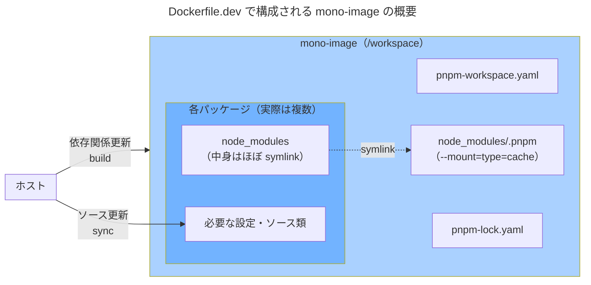
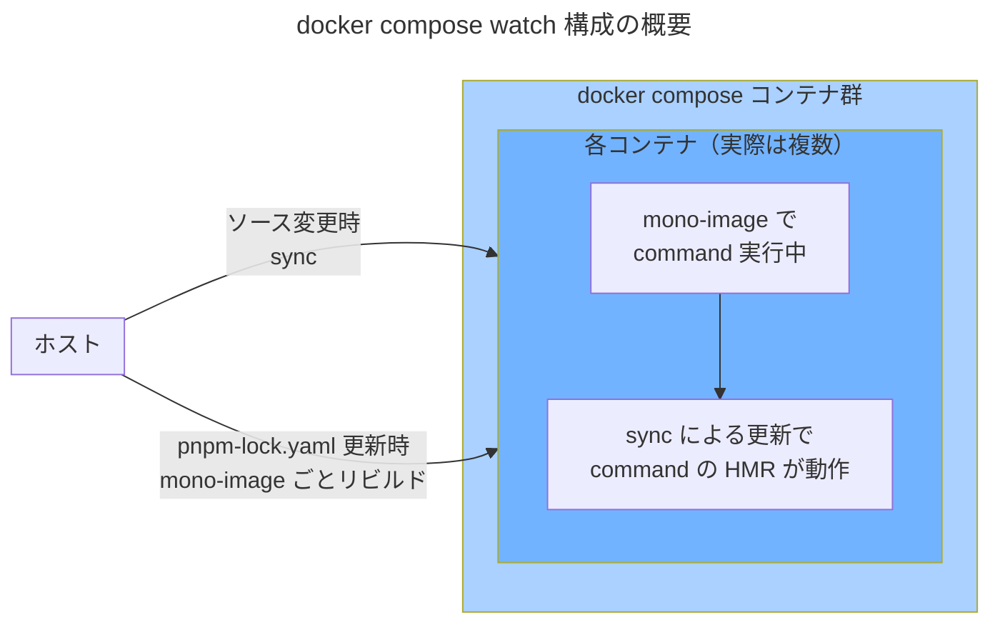

## はじめに

pnpm モノレポ + docker compose 開発環境を、個人開発の Web アプリ向けに構成しています。
ただ、これらを組み合わせて使用する際の正解は無い様で、試行錯誤しています。


現在は、**mono-image + watch 方式** と呼んでいる手法に切り替えています。
- pnpm monorepo 特有の symbolic link を多用するパッケージ管理と相性が良い
- ホスト-コンテナ を跨ぐファイル更新でトリガーされる HMR 機能と相性が良い
- 開発環境用 docker イメージが 1 つで不要な volume が残らず、ホストのディスク使用量が少ない

...といった利点があります。

> **mono-image** は造語です。
> 開発用に割り切った pnpm workspace 全体をカバーする docker image で、
> 説明的には shared workspace image といったところです。

## mono-image + watch 方式の解説
### mono-image について
これは素朴に pnpm workspace 全体を包含する docker image です。 

:::details Dockerfile.dev 構成例
```dockerfile
FROM node:24-slim
WORKDIR /workspace
RUN corepack enable && corepack prepare pnpm@11.5.3 --activate

# 依存定義だけ先に COPY して install 層をキャッシュする。
# ソースを変えてもこの層は無効化されない。
COPY package.json pnpm-lock.yaml pnpm-workspace.yaml ./
COPY backend/package.json ./backend/
COPY frontend/package.json ./frontend/
COPY worker/package.json ./worker/

# pnpm の store を BuildKit のキャッシュに載せ、再ビルド時の再ダウンロードを避ける
RUN --mount=type=cache,target=/root/.local/share/pnpm/store \
    pnpm install --frozen-lockfile

# ソースを焼き込む（compose watch が差分だけ上書き同期する）
COPY backend/ ./backend/
COPY frontend/ ./frontend/
COPY worker/ ./worker/
```
マニフェストを先に COPY → `pnpm install` → ソースを COPY の順がおすすめです。
ソース変更では install 層がキャッシュヒットして再ビルドが速く、`--mount=type=cache` が store の再ダウンロードも防ぎます。

あわせて、ルートに `.dockerignore` を置いて COPY に巻き込みたくないものを除外します。
取り込む範囲が広くなりがちですので、不要ファイルを除外する設定はより重要になります。
```text:.dockerignore
**/node_modules
**/.next
**/dist
.git
.env*
```
:::



依存関係が更新されたらこのイメージをリビルドします （後述の様に自動化も可能です）。

### `docker compose watch` について
ホスト側のファイル変更を検知し、コンテナに指定したアクションを起こせます。
:::details compose.yaml 構成例
```yaml
services:
  database:
    image: mysql:8.4
    env_file:
      - .env.database
    healthcheck:
      test: mysql -u $$MYSQL_USER -p$$MYSQL_PASSWORD $$MYSQL_DATABASE -e "select 1;"
      interval: 5s
      timeout: 20s
      retries: 5
      start_period: 5s

  backend:
    build:
      context: .
      dockerfile: Dockerfile.dev
    working_dir: /workspace/backend
    command: tsx watch
    env_file:
      - .env.database
      - .env.backend
    depends_on:
      database:
        condition: service_healthy
    develop:
      watch:
        - action: sync+restart
          path: ./backend
          target: /workspace/backend
          ignore:
            - node_modules/
            - dist/
        - action: rebuild
          path: pnpm-lock.yaml

  frontend:
    build:
      context: .
      dockerfile: Dockerfile.dev
    working_dir: /workspace/frontend
    command: vite dev
    env_file:
      - .env.frontend
    depends_on:
      database:
        condition: service_healthy
    develop:
      watch:
        - action: sync
          path: ./frontend
          target: /workspace/frontend
          ignore:
            - node_modules/
            - .next/
        - action: sync
          path: ./backend
          target: /workspace/backend
          ignore:
            - node_modules/
            - dist/
        - action: rebuild
          path: pnpm-lock.yaml

  worker:
    build:
      context: .
      dockerfile: Dockerfile.dev
    working_dir: /workspace/worker
    command: tsx watch
    env_file:
      - .env.worker
    depends_on:
      - backend
    develop:
      watch:
        - action: sync+restart
          path: ./worker
          target: /workspace/worker
          ignore:
            - node_modules/
            - dist/
        - action: sync+restart
          path: ./backend # backend の型を import するので一緒に同期
          target: /workspace/backend
          ignore:
            - node_modules/
            - dist/
        - action: rebuild
          path: pnpm-lock.yaml
```
:::


`sync（同期）` `sync + restart（同期して再起動）` `rebuild（再ビルド）` のいずれかを指定できます（Compose v2.22 以降）。
@[card](https://docs.docker.com/compose/how-tos/file-watch/)

開発環境を動作させつつ変更分だけ watch でコンテナに送り込んで、`tsx watch`, `vite dev`, `next dev`... 等の HMR 機能を、必要なコンテナに対してのみトリガーできます。
> - コンテナ内の dev コマンドに HMR 機能が無くても sync + restart を指定する
> - rebuild することでイメージの更新が必要な場合にも対応できる
> 
> ...など、色々応用が効きます。


## Why / Why not
### Q. node\_modules やソースを volume mount する方がシンプルでは？
以下の意図で、あえて volume mount を避けています：
- 非 Linux ホストの node\_modules がコンテナ内に入り込むのを避ける
  > 各 node\_modules を named volume にする手段はあります... が、永続化したい訳でないのにホストのディスク使用量が増えるので、これも間接的に避けています
- pnpm monorepo の特徴である、symlink を多用する node\_modules 構成が壊れるのを避ける
  > pnpm monorepo では workspace root の node\_modules に実体があり、各 packages の node\_modules は symlink で、この参照を壊さない様にする面倒を避けます
  > また、永続化したい訳でないのにホストのディスクを消費するのも避けています
- ホスト-コンテナ 間のファイル共有による HMR 発火ミスを避ける
  > volume mount ではファイル更新や追加に伴う HMR 検出を失敗する場合があり、それを避けています

### Q. モノレポまるごと 1 つの docker image はやりすぎでは（パッケージ毎に異なるイメージにするべきでは）？
- イメージサイズ / ビルド時間の観点では、合計を考慮すると得だと考えています
  > 開発用であると割り切っている面もありますが、別イメージだと合計値になります
  > キャッシュがあるとはいえ、トータルで見れば 1 イメージの方が得をしそうです
  >
  > また、イメージサイズ削減は本番用イメージ向けの観点なので、別の本番用 Dockerfile（これは各 package で個別）で最適化します
- workspace 参照（他 package への依存）が多い場合でもスムーズです
  > 個別イメージにする場合 package 間の依存関係をそれぞれ把握し、COPY / volume 設定する必要があります

## まとめ

volume mount 方式から mono-image + watch 方式へ移したことで、

- ホスト-コンテナ間の bind mount での HMR の不安定さ
- 構成ファイルの複雑さ

といった、長年ふわっと我慢していた問題がまとめて解消されました。

`Dockerfile.dev` が pnpm の symlink の網ごとイメージに閉じ込め、`docker compose watch` が差分だけを届ける——この対が方式の本体です。

日々の開発体験としては移行して良かった、というのが今の結論です。
調べてみるとこの方向性は Docker 公式やコミュニティでも「bind mount の現代的な代替」として推されており、その意味で「枯れた最適解に寄せた」記録でもあります。

同じように pnpm monorepo を Docker で回している方の、それぞれの「落としどころ」も知りたいところです。

