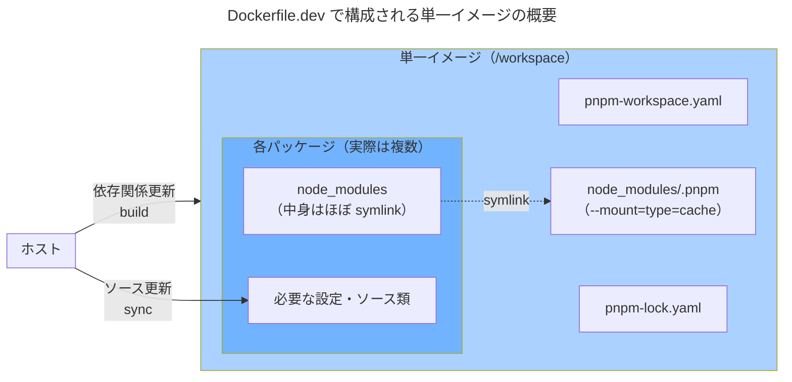
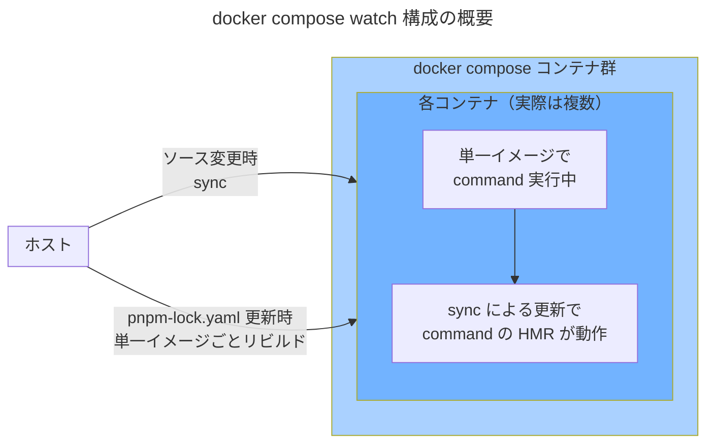

## はじめに

pnpm モノレポ + docker compose 開発環境を、個人開発の Web アプリ向けに構成しています。
モノレポの各パッケージが、Docker コンテナとなって動作するイメージです。

ただ、pnpm モノレポと docker compose を組み合わせて使用する際の正解ははっきりしない感覚があり、試行錯誤していました。

```yaml
# 設定は両方とも yaml ファイルですが、pnpm と docker compose は全然違う道具です
# だからこそ、組み合わせて使う方法は色々考えられます
# pnpm-workspace.yaml
# symbolic link を使用した効率的なモノレポ構成の設定
packages:
  - frontend
  - backend
  - worker
# compose.yaml
# Docker container を協調動作させ、ホストへのファイルやポートの共有も設定
# モノレポのパッケージが Docker コンテナとなる感覚です
services:
  frontend: (省略)
  backend: (省略)
  worker: (省略)
```

現在は、**単一イメージ + compose watch 方式** と呼んでいる手法に切り替えています。

**パッケージ間で共通の環境/依存が多い + パッケージ間の依存が多い** という私の多用するモノレポ構成と合っています。
pnpm モノレポの多くはこの性質を持っているのでは？という感覚もあり、この記事で整理してみます。

- pnpm モノレポ特有の symbolic link を多用するパッケージ管理と相性が良い
- ホスト-コンテナを跨ぐファイル更新でトリガーされる HMR 機能と相性が良い
- 開発環境用 docker イメージが 1 つでシンプル

...といった利点があります。


*この記事で言いたいことの半分を図にしてみました
もう半分は pnpm モノレポの symlink 構成を自然に取り込める部分です*

## 単一イメージ + compsoe watch 方式の解説
次のような pnpm workspace 構成を題材にしてみます
```yaml:pnpm-workspace.yaml
packages:
  - frontend
  - backend
  - worker
```
### 単一イメージについて
これは素朴に pnpm workspace 全体を包含する Docker イメージです。 
依存関係が更新されたらこのイメージをリビルドします （後述の様に自動化も可能です）。


```mermaid
---
title: Dockerfile.dev で構成される単一イメージの概要
---
flowchart LR
  subgraph host["ホスト"]
    
  end

  subgraph image["単一イメージ（/workspace）"]
    direction TB
    subgraph fe["各パッケージ（実際は複数）"]
      nm["node_modules<br/>（中身はほぼ symlink）"]
      sc["必要な設定・ソース類  "]
    end
    workspace["pnpm-workspace.yaml"]
    store["node_modules/.pnpm<br/>（--mount=type=cache）"]
    lock["pnpm-lock.yaml"]
    nm -. symlink .-> store
  end

  host -- "ソース更新<br>sync" --> sc
  host -- "依存関係更新<br>build" --> image

  style image fill:#0077ff55
  style fe fill:#0077ff55
```

#### `Dockerfile.dev` 構成例
```dockerfile:Dockerfile.dev
FROM node:24-slim
WORKDIR /workspace
RUN corepack enable && corepack prepare pnpm@11.5.3 --activate

# 依存定義だけ先に COPY して install 層をキャッシュする。
# ソースを変えてもこの層は無効化されない。
COPY package.json pnpm-lock.yaml pnpm-workspace.yaml ./
# 各 packages の設定ファイルを追加
COPY backend/package.json ./backend/
COPY frontend/package.json ./frontend/
COPY worker/package.json ./worker/

# pnpm の store を BuildKit のキャッシュに載せ、再ビルド時の再ダウンロードを避ける
RUN --mount=type=cache,target=/root/.local/share/pnpm/store \
    pnpm install --frozen-lockfile

# ソースを焼き込む（compose watch が差分だけ上書き同期する）
COPY backend/ ./backend/
COPY frontend/ ./frontend/
COPY worker/ ./worker/
```

> マニフェストを先に COPY → `pnpm install` → ソースを COPY の順がおすすめです。
> ソース変更では install 層がキャッシュヒットして再ビルドが速く、`--mount=type=cache` が store の再ダウンロードも防ぎます。
>
> 合わせて、ルートに `.dockerignore` を置いて COPY に巻き込みたくないものを除外します。
取り込む範囲が広くなりがちですので、不要ファイルを除外する設定はより重要になります。
```sh:.dockerignore
# 特に非 Linux ホストで node_modules 混入を防ぐ
**/node_modules
# 開発環境に不要なファイル類を除外
**/.next
**/dist
.git
.env*
```


### `docker compose watch` について
ホスト側のファイル変更を検知し、コンテナに指定したアクションを起こせます。
:::details compose.yaml 構成例
```yaml
services:
  backend:
    build:
      context: .
      dockerfile: Dockerfile.dev # mono-image を使用
    working_dir: /workspace/backend
    command: tsx watch # mono-image 内で HMR 機能付きの開発環境起動コマンドを実行
    env_file:
      - .env.database # DB 接続設定など環境変数を渡す、mono-image には含めない
      - .env.backend  # （この方法で渡せば restart で環境変数変更を反映できるため）
    depends_on:
      database:
        condition: service_healthy
    develop:
      watch:
        - action: sync # sync だけでも tsx watch が HMR を行う
          path: ./backend # backend パッケージの変更のみ扱う
          target: /workspace/backend
          ignore:
            - node_modules/ # 依存関係の更新は rebuild で扱う、監視ファイルが多すぎると docker compose watch はエラーになるという背景も
            - dist/         # ホスト側の生成ファイル類は開発環境に不要な想定
        - action: rebuild
          path: pnpm-lock.yaml # 依存関係が更新されたら mono-image ごとリビルド

  frontend:
    build:
      context: .
      dockerfile: Dockerfile.dev
    working_dir: /workspace/frontend
    command: vite dev
    env_file:
      - .env.frontend
    depends_on:
      database:
        condition: service_healthy
    develop:
      watch:
        - action: sync
          path: ./frontend
          target: /workspace/frontend
          ignore:
            - node_modules/
            - .next/
        - action: sync
          path: ./backend
          target: /workspace/backend
          ignore:
            - node_modules/
            - dist/
        - action: rebuild
          path: pnpm-lock.yaml

  worker:
    build:
      context: .
      dockerfile: Dockerfile.dev
    working_dir: /workspace/worker
    command: tsx watch
    env_file:
      - .env.worker
    depends_on:
      - backend
    develop:
      watch:
        - action: sync+restart
          path: ./worker
          target: /workspace/worker
          ignore:
            - node_modules/
            - dist/
        - action: sync+restart
          path: ./backend # backend の型を import するので一緒に同期
          target: /workspace/backend
          ignore:
            - node_modules/
            - dist/
        - action: rebuild
          path: pnpm-lock.yaml

  # データベースも扱う例
  database:
    image: mysql:8.4
    env_file:
      - .env.database
    healthcheck:
      test: mysql -u $$MYSQL_USER -p$$MYSQL_PASSWORD $$MYSQL_DATABASE -e "select 1;"
      interval: 5s
      timeout: 20s
      retries: 5
      start_period: 5s
```
:::

```mermaid
---
title: docker compose watch 構成の概要
---
flowchart LR
  subgraph host["ホスト"]
  end
  subgraph compose["docker compose コンテナ群"]
    subgraph fe["各コンテナ（実際は複数）"]
      direction TB
      s0["単一イメージで<br>command 実行中"]
      s1["sync による更新で<br>command の HMR が動作"]
    end
  end

  host -- "ソース変更時<br>sync" --> fe

  host -- "pnpm-lock.yaml 更新時<br>単一イメージごとリビルド" --> fe

  s0 --> s1
  
  style compose fill:#0077ff55
  style fe fill:#0077ff55
```

`sync（同期）` `sync + restart（同期して再起動）` `rebuild（再ビルド）` のいずれかを指定できます（Compose v2.22 以降）。
@[card](https://docs.docker.com/compose/how-tos/file-watch/)

開発環境を動作させつつ変更分だけ watch でコンテナに送り込んで、`tsx watch`, `vite dev`, `next dev`... 等の HMR 機能を、必要なコンテナに対してのみトリガーできます。

コンテナ内の dev コマンドに HMR 機能が無くても sync + restart を指定してほぼ同等の動作を実現したり、rebuild することでイメージの更新が必要な変更... 例えば依存関係の更新にも対応できたりですとか、色々応用が効きます。


## Why / Why not
### Q. ソースや node\_modules を bind mount する方がシンプルでは？
以下の意図で、あえて bind mount を避けています：
- **非 Linux ホストの `node_modules` がコンテナ内に入り込むのを避けます**
  - 各 node\_modules を named volume にしてホストと分離できますが、ホストのディスク使用量が増えます
- **pnpm モノレポの特徴である、symlink を多用する `node_modules` 構成が壊れるのを避けます**
  - pnpm モノレポでは workspace root の node\_modules に実体があり、各 packages の node\_modules は symlink を使用します、これを壊さないようにします
- **ホスト-コンテナ 間のファイル共有による HMR 発火ミスを避けます**
  - bind mount ではファイル更新や追加に伴う HMR 検出を失敗する場合があり、それを避けています
    - Next.js 開発環境起動コマンド `next dev` がコンテナ内で実行されていると、ホスト→コンテナへのファイル新規作成を検出できなかったりします

### Q. モノレポまるごと 1 つの Docker イメージはやりすぎでは（パッケージ毎に異なるイメージにするべきでは）？
- **イメージサイズ / ビルド時間の観点では、合計を考慮すると単一が得しそう**
  - 別イメージだとサイズもビルド時間も合計値ですから、キャッシュを加味してもトータルでは単一イメージが得をしそうです
  :::message 
    イメージサイズ削減は本番向けの観点なので、別の Dockerfile で最適化します
  :::
- **1 つの package の依存関係の変更のために単一イメージの再ビルドが必要なのは、実は不利になりません**
  - 個別イメージ方式でも、pnpm モノレポではルートの pnpm-lock.yaml が更新され、全イメージの再ビルドが必要になりがちです
- **package 間の依存が多い場合でもスムーズです**
  - 個別イメージの場合 package 間の依存関係を手動で COPY / volume 記述する必要がありますが、単一イメージだと自然に解決できます

### Q. bind mount でなく sync だと、コンテナ → ホスト方向のファイル共有ができないのでは？
- **直感的には、開発環境に必要なファイルや依存関係はコンテナの中に閉じ込める方向で行きたいです**
  - どうしても必要になりそうなパターン...例えば「コード生成を行う package を他の package から参照する」場合でも...
    1. 動的な db 構成からのコード生成などコンテナから行えない操作はホストでコードを生成して単一イメージに含める
      （docker container の 1 つである db に docker build 中に接続するのはちょっと大変です）
    2. 動的なコード生成を行う場合は、build 中でなく command に含め、コンテナ起動の最初に行うことで sync + restart での更新を行う
  
## まとめ
bind mount で頑張っていた時より開発体験が向上しており、移行して良かったと感じます。
`docker compose watch` の存在にもっと早く気付ければ... 日頃よく使うツールのキャッチアップを工夫したいです。
同じように pnpm モノレポを docker compose で回している方の、それぞれの「落としどころ」も知りたいです。

