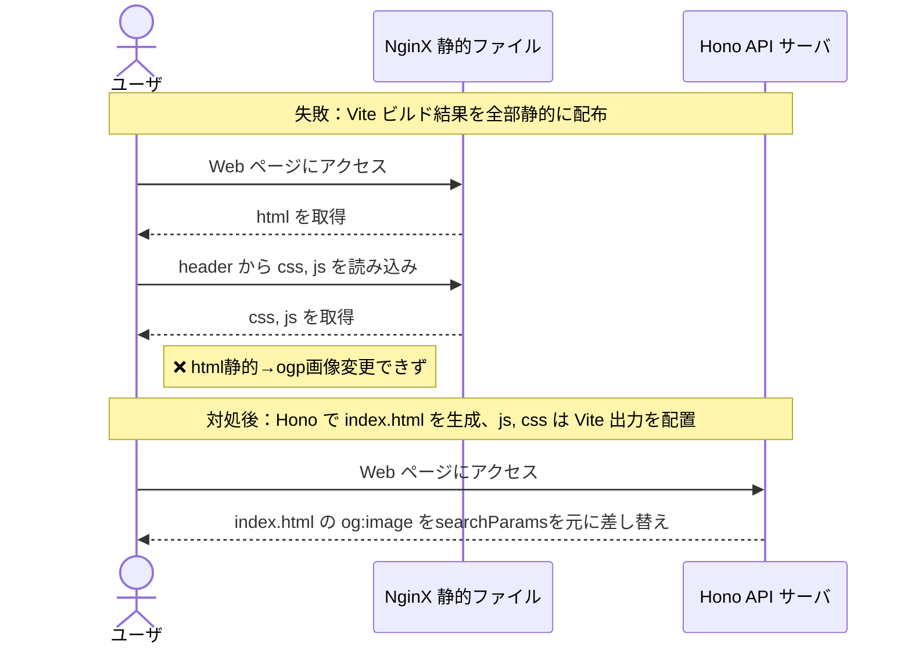

## 概要
サカバンバスピス、某有名な復元模型や各種グッズとして現代で繁栄しています。
誰も本物の顔を見たことがありませんから、ちょっとずつ顔付きが違うのがまた良いですよね。

ということで、サカバンバスピスの顔をひたすらランダム生成して、好みのサカバンバスピスをシェアできる Web アプリケーションを作りました！

@[card](https://sacapis2026.faveo-systema.net)

|スクリーンショット 01|スクリーンショット 02|
|---|---|
|||

## この Web アプリの機能・特徴
苦労したポイント、詳しく紹介するポイントを**太字**にしています：

- **メインは Vite による軽量な SPA です**
  - **OGP 画像の表示のため、後から Hono による SSR と組み合わせました**
  - 丁度良いフレームワークを思い付かず、年末までに公開するため経験のある技術の組み合わせになりました
- ボタンを押すと目、口、鼻をランダム配置しますが、重なる場合は再生成します
- 目安として「サカバンバスピスっぽい顔」を内部で設定しており、そこから離れるほど表示名が変になっていきます（例：ピスピスピスピス）
- 名前の語感から「つよさ」が決まり、それによって名前表示のフォントが変わります
- 1000件分の履歴を localStorage に保持しており、うっかり連打しすぎても戻れます
- searchParams や画面下部に表示されるシード値を元に決定論的に乱数を生成して顔を作るので、シード値付きの現在の URL をシェアすれば誰でも同じ顔を見られます
- **OGP 画像はシード値に対応する画像になります**

## 苦労したポイント
最初は「単純な Web アプリで、静的ファイル配置だけで済みそうだからフロントエンド部分は Vite だけで作ろう」と考えていました。
しかし、是非とも実現したい「OGP 画像を searchParams に応じた顔画像にする」部分で開発後半になってから勘違いが発覚しました...

