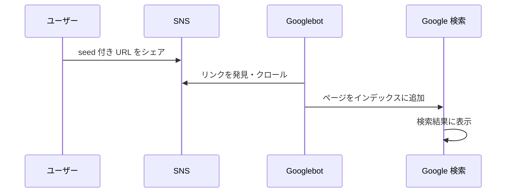

## はじめに — 何が起きたのか

サカバンバスピスの顔をランダム生成する Web アプリを開発しました。seed 値からキャラクターの顔を生成し、気に入った顔を `?seed=xxx` 付きの URL でシェアできます。

顔がサカバンバスピスっぽいかで名前もサカバンバスピスっぽくなったり、ならなかったりします。

@[card](https://sacapis2026.faveo-systema.net)

@[card](https://sacapis2026.faveo-systema.net/?seed=12345678)

@[card](https://sacapis2026.faveo-systema.net/?seed=87654321)

|スクリーンショット 1|スクリーンショット 2|
|---|---|
|||

なのでメインの遊び方として「サカバンバスピス」が出るまで顔生成ボタンを連打してもらうというのがあるのですが、**見落としに気づきました**。

ある日、自分のサイト名で Google 検索してみたところ、**ユーザーがシェアした「サカバンバスピス」seed 付きの URL が検索結果に表示されている**ことに気づきました。


:::message 
もちろん、**こうやってユーザーに URL をシェアしてもらうのはとても嬉しいです！**

ですが本来、検索結果に出てほしいのはシード値無しの URL だけで、`?seed=12345` のような個別の URL は検索に出てほしくありません。

しかし、**`noindex` も `canonical` も設定していないという技術的な問題がありました。**
:::

しかも**ユーザーがこの URL にアクセスすると、ユーザーが自分で発見したのと区別がつかず、発見する楽しみを失ってしまう**という大きなおまけ付きです。


この記事では、この失敗に気づいてから対応するまでの経緯を紹介します。

## なぜインデックスされたのか

原因を整理すると、次のような流れでした。



このアプリは OGP 画像をシード毎に描画するため、Hono で SSR（サーバーサイドレンダリング）しています。Googlebot にとっては各 seed 付き URL が**実質的に別のページ**に見えていたわけです。

`noindex` メタタグがなかったため、Google はこれらを通常のページとしてインデックスに追加し、`canonical` タグもなかったため、URL の正規化も行われませんでした。

:::message
Next.js 等のフレームワークであれば、HTML のキャッシュ制御や SEO 関連の設定がある程度カバーされますが、Hono + Vite の軽量構成ではこういった部分を自分で対応する必要があります。自由度が高い反面、設定漏れのリスクがあることを痛感しました。

おまけに index.html をキャッシュさせるかの設定も明示しておらず、そのために別の問題も出ましたが、また別の記事で...
:::

## 対応その1: Google Search Console の所有権確認

まず、Search Console でサイトを管理できるようにするため、所有権の確認を行いました。確認方法はいくつかありますが、今回は HTML メタタグを埋め込む方法を選びました。

@[card](https://support.google.com/webmasters/answer/9008080?hl=ja)

```tsx
{/* Google Search Console Tags */}
<meta
  name="google-site-verification"
  content="（google search console で指示されたメタタグの値）"
/>
```

Hono の SSR テンプレート（`IndexPage.tsx`）の `<head>` 内に上記のタグを追加しました。

## 対応その2: Google Search Console から検索結果を削除

所有権の確認ができたら、既にインデックスされてしまった URL を検索結果から消すために、Google Search Console の「削除」機能を使いました。

@[card](https://developers.google.com/search/docs/crawling-indexing/remove-information?hl=ja)


Google Search Console には「一時的な削除」という機能があり、特定の URL やプレフィックスに一致する URL を約6ヶ月間、検索結果から非表示にすることができます。

:::message alert
この機能はあくまで**一時的な非表示**です。6ヶ月後には再びインデックスされる可能性があるため、根本的な対策（noindex や canonical の設定）が別途必要です。
:::

## 対応その3: noindex の設定

seed 付きページが今後インデックスされないよう、seed パラメータが存在する場合に `noindex` メタタグを出力するようにしました。

```tsx
{seed && <meta name="robots" content="noindex, follow" />}
```

`noindex` は「このページを検索結果に表示しないで」という指示で、`follow` は「ページ内のリンクは引き続きクロールしてよい」という意味です。seed がないトップページにはこのタグが出力されないため、トップページは通常通りインデックスされます。

## 対応その4: canonical URL の設定

さらに、すべてのページに `canonical` タグを追加し、正規 URL をトップページに統一しました。

```tsx
// app.tsx — URL の生成
const canonicalUrl = baseUrl.endsWith("/") ? baseUrl : `${baseUrl}/`;
```

```tsx
// IndexPage.tsx — canonical タグの出力
<link rel="canonical" href={canonicalUrl} />
```

ここでのポイントは、**`og:url` と `canonical` で異なる URL を使い分けている**点です。

| 用途 | URL | 例 |
|------|-----|----|
| `og:url`（SNS シェア用） | seed 付き | `https://sacapis2026.faveo-systema.net/?seed=12345` |
| `canonical`（SEO 用） | seed なし | `https://sacapis2026.faveo-systema.net/` |

`og:url` に seed 付き URL を使うことで、SNS でシェアされたときに正しい OGP 画像が表示されます。一方、`canonical` はルート URL を指すことで、Google に「これらのページの正規版はトップページです」と伝えています。

## 考察: noindex と canonical、どちらが適切だったか

実は、現在の実装では seed ページに `noindex` と `canonical`（ルートへの参照）を**両方**設定しています。これは**混合シグナル**になりうることを後から知りました。

- **`noindex`** = 「このページをインデックスしないで」
- **`canonical`（他ページへの参照）** = 「このページの正規版は別の URL にある」

両方を同時に指定すると、Google にとっては意図が曖昧になります。Google の公式ドキュメントによると、この場合は `noindex` が優先される傾向があるようです。

### 代替案: canonical のみにする

`noindex` を外して `canonical` だけにする方法もあります。

canonical をルートに向ければ、Google は seed ページをルートの重複コンテンツと見なし、検索結果にはルート URL のみを表示します。これはよりセマンティックに正しいアプローチと言えます。

### 今回の判断

今回は **`noindex` を残す** 判断をしました。理由は、seed ページが検索結果に出ないことを最優先にしたかったためです。`canonical` だけの場合、Google が canonical の指定を無視するリスク（ごくわずかですが）があります。

どちらを選ぶかはリスク許容度によります。

| アプローチ | メリット | デメリット |
|-----------|---------|-----------|
| `noindex` + `canonical` | 確実に検索結果から除外 | 混合シグナル、SEO シグナルの統合が不十分 |
| `canonical` のみ | セマンティックに正しい、SEO シグナルが統合される | canonical を Google が無視する可能性がわずかにある |

## robots.txt について

補足として、`robots.txt` についても触れておきます。現状では seed 付き URL のクロール抑制をコメントアウトしています。

```txt
User-agent: *
Allow: /

# seed付きURLへのクロールを抑制（noindex効果確認後に有効化）
# Disallow: /*?seed=
```

`noindex` の効果が Search Console 上で確認できたら、`Disallow` を有効化する予定です。ただし、**`robots.txt` の `Disallow` はクロール自体を抑制するものであり、既にインデックスされた URL の削除には効果がない**点には注意が必要です。既にインデックスされた URL を消すには、Search Console の削除機能や `noindex` タグが必要です。

## おまけ: アプリ側の対応 — シェアされた顔の区別

SEO 対策とは別に、アプリ側でも対応を行いました。

前述の通り、このアプリには「サカバンバスピスを自分で見つける楽しみ」があります。しかし、検索結果から seed 付き URL にアクセスしたユーザーには、**それが自分で発見した顔なのか、他人がシェアした顔なのか区別がつかない**という問題がありました。

そこで、URL の seed がユーザーの閲覧履歴（localStorage）に存在しない場合、「シェアされたかお」として表示する仕組みを追加しました。

- シェアされた顔はサカピス図鑑（コレクション機能）に自動登録しない
- 「NEW!」バッジ（初発見表示）を出さない
- 「つぎのかお」ボタンが「さがしてみる」に変わり、自分で探索を始められる

```tsx
// 履歴にないseed かつ 図鑑に未登録の名前 → シェアされた顔
const isSharedFace = seedNotInHistory
  && nameData !== null
  && !isDiscovered(nameData.name)
```

これにより、検索やシェアから来たユーザーも、そこから自分自身の探索を始められるようになっています。

## まとめ

今回の失敗から得た教訓をまとめます。

- **公開前に `noindex` / `canonical` 設定を一通り見直すべき**。特にクエリパラメータで内容が変わるページは、意図せずインデックスされるリスクがある
- **フレームワークに頼らず SSR する場合、SEO 関連の設定は自分で責任を持つ必要がある**。Hono + Vite のような軽量構成では、こうした設定を忘れがち
- **Google Search Console は早めにセットアップしておく**。問題が発覚してからでは、所有権確認から始めることになり、対応が遅れる

些細な設定漏れでしたが、実際に起きてみると意外と焦りました。同じような構成でアプリを作っている方の参考になれば幸いです。
