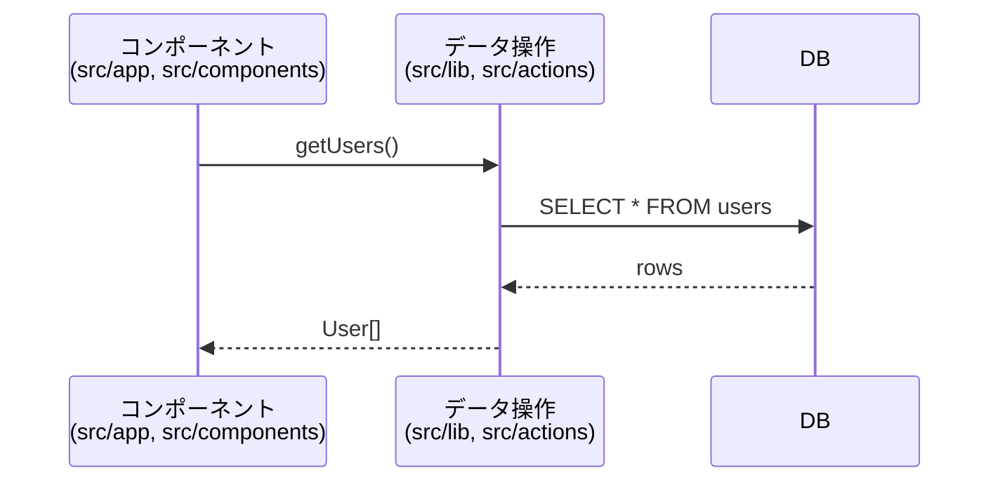
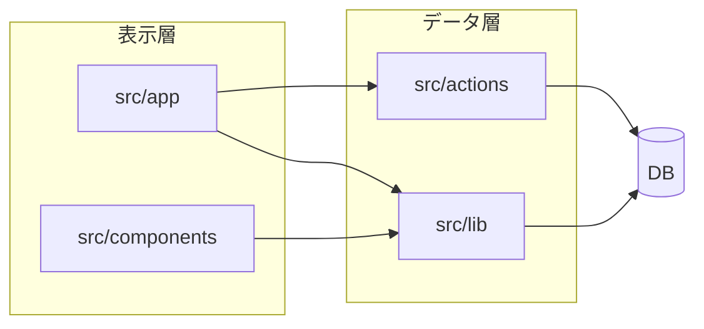
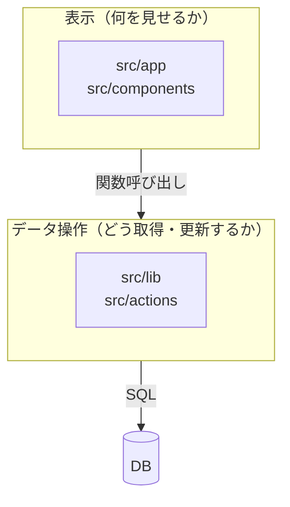
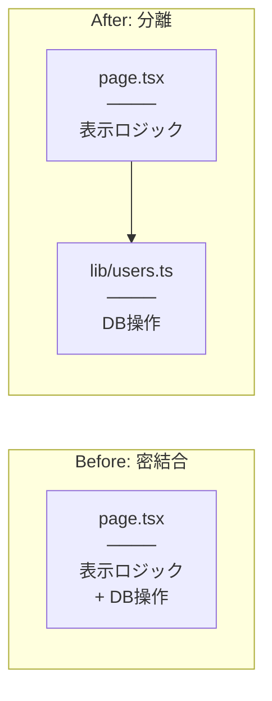
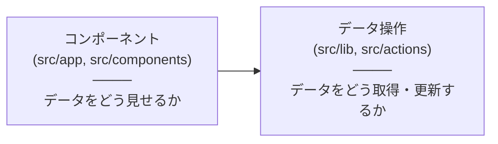

## はじめに

Next.js の Server Actions や Server Components は、サーバーサイドの処理を直接呼び出せる便利な機能です。しかし、データ取得・操作を行う API サーバを分離したくなる場面もあります。

- バックエンド処理をモバイルアプリからも呼び出したい
- Next.js 以外の技術への移植を容易にしておきたい
- サーバサイド処理を Rust など他の言語で書きたい / 書いてある
- Vercel からセルフホストの DB に接続する際の制約を回避したい
- などなど...

この記事では、
- Next.js からバックエンド処理を新規 API サーバに移す際に...
  - DB も含むシステム全体の設計をどうするか
  - REST API エンドポイントの設計をどうするか
  - 型安全な Next.js ↔︎ API サーバの通信を実現する例にはどんなものがあるか

を、少しずつ検討していきます。

## システム全体の設計

Next.js（Vercel）と API サーバを分離する際の構成を考えます。

### データ取得・操作の分離
先ずはデータの取得・操作を行う処理を把握し、可能ならば `src/lib` など別ファイルに分離します。

```mermaid
architecture-beta
  group nextjs(logos:aws-lambda)[Nextjs]

  service db(logos:aws-glacier)[Storage] in nextjs
```


<!-- 案1: シンプルなシーケンス図（呼び出しの流れ） -->


<!-- 案2: フローチャート（依存関係の方向） -->


<!-- 案3: フローチャート（縦方向レイヤー） -->


<!-- 案4: Before/After 比較（密結合 vs 分離） -->


<!-- 案5: シンプルな2ボックス -->


### （仮）Vercel からセルフホスト DB への接続課題

Vercel からセルフホストの MySQL に直接接続する構成には課題があります。

**IP 制限が難しい**: Vercel の Serverless Functions は実行元 IP が固定されないため、DB 側でファイアウォールによる IP 制限ができません。

**コネクション数の問題**: Serverless 環境ではリクエストごとに新しいインスタンスが起動するため、同時リクエスト数がそのまま DB 接続数になります。MySQL の `max_connections`（デフォルト 151）にすぐ達してしまいます。

:::message
PlanetScale や Neon などの DBaaS を使う場合、この課題はプロキシ層で解決されているため、API サーバを挟む必要は薄れます。
:::

### （仮）API サーバを挟む構成

API サーバを DB と同じ場所（例: VPS）にホストすることで、上記の課題を解決できます。

```
[ユーザー] → [Vercel (Next.js)] → [API サーバ] → [DB]
                                    └─ 同じVPSにホスト
```

### 副次的なメリット

API サーバを分離することで、以下のようなメリットも得られます。

- **セキュリティ境界の明確化**: HTTP エントリポイントを明示的に設計でき、フレームワークの脆弱性の影響範囲を限定しやすい
- **責務の分離**: フロントエンドは表示、バックエンドはデータ操作に集中でき、テストもしやすくなる

### この構成のトレードオフ

この構成では、Vercel 側は Serverless でスケールしますが、API サーバは単一サーバで動作するため、ここがボトルネックになります。

以下のような状況であれば、この構成でも問題になりにくいです。

- バックエンドへのアクセス頻度が低く、処理が軽量
- 負荷集中時のレイテンシ増加が許容できる
- API サーバ自体を Serverless 構成（Cloud Run、Fly.io など）で運用している

## REST API エンドポイントの設計

フロントエンド開発者がバックエンドを作る際、API 設計で迷うポイントがあります。ここでは実践的な指針を紹介します。

### リソース指向と HTTP メソッド

API は「リソース」を中心に設計します。URL はリソースを表し、HTTP メソッドで操作を区別します。

| 操作 | メソッド | URL 例 | 説明 |
|------|----------|--------|------|
| 一覧取得 | GET | `/characters` | コレクション全体を取得 |
| 個別取得 | GET | `/characters/:id` | 特定のリソースを取得 |
| 作成 | POST | `/characters` | 新しいリソースを作成 |
| 更新 | PUT/PATCH | `/characters/:id` | 既存リソースを更新 |
| 削除 | DELETE | `/characters/:id` | リソースを削除 |

**ポイント:**
- URL は名詞（リソース名）、動詞はメソッドで表現
- 複数形を使う（`/characters`、`/votes`）
- ネストは浅く保つ（`/users/:id/votes` は OK、深くなりすぎたら見直す）

### エンドポイント命名の指針

迷ったときの判断基準:

1. **そのデータは何のリソースか？** → URL のパスになる
2. **何をしたいのか？** → HTTP メソッドになる
3. **誰のデータか？** → パスパラメータか、認証情報から取得

例: 「ユーザーの投票を取得したい」
- リソース: votes
- 操作: 取得（GET）
- 誰の: パスパラメータで指定
- → `GET /votes/:userId`

### Zod バリデーション

`@hono/zod-validator` を使うことで、リクエストの検証と型推論を同時に行えます。

- パスパラメータ: `zValidator('param', z.object({ id: z.string() }))`
- リクエストボディ: `zValidator('json', schema)`
- クエリパラメータ: `zValidator('query', schema)`

バリデーションエラー時は自動的に 400 が返されます。

### 認証ミドルウェア

認証処理はミドルウェアで一元化します。各エンドポイントに認証ロジックを書く必要がなくなります。

- Bearer Token を使った API キー認証
- 認証失敗時は早期に 401 を返す
- 認証成功時のみ `await next()` で後続処理へ

### エラーレスポンスの設計

エラー時も一貫した構造で返すと、クライアント側で扱いやすくなります。

```typescript
// 成功時
return c.json({ data: result }, 200)

// エラー時
return c.json({ error: 'Not found' }, 404)
```

HTTP ステータスコードの使い分け:
- 200: 成功
- 400: リクエストが不正（バリデーションエラー）
- 401: 認証が必要
- 404: リソースが見つからない
- 500: サーバーエラー

## 型安全な通信: Hono RPC

Hono RPC は、サーバ側のルート定義から型情報をエクスポートし、クライアント側で型安全な API クライアントを生成する仕組みです。

特徴:
- サーバ側でルートを定義すると、その型情報を `AppType` としてエクスポートできる
- クライアント側で `hc<AppType>()` を呼ぶと、パスやパラメータ、レスポンスの型が自動補完される
- OpenAPI スキーマの生成やコード生成は不要

### サーバ側: ルート定義と型エクスポート

```typescript:server-ts/src/app.ts
import { Hono } from 'hono'
import { zValidator } from '@hono/zod-validator'
import { z } from 'zod/v4'
import { getCharacters } from './lib/characters'
import { getLatestVotes, insertVotesIfUpdated } from './lib/votes'

const apiKey = process.env.API_KEY ??
  (() => { throw new Error('process.env.API_KEY is not defined!') })()

export const app = new Hono()

// 単純なAPIキー認証
app.use('*', async (c, next) => {
  const authHeader = c.req.header('Authorization')
  if (!authHeader) return c.body(null, 401)
  const tokens = authHeader.split(' ')
  if (tokens.length != 2) return c.body(null, 400)
  const [bearer, apiKeyToken] = tokens
  if (bearer !== 'Bearer') return c.body(null, 400)
  if (apiKeyToken !== apiKey) return c.body(null, 401)
  await next()
})

const route = app
  .get('/characters', async (c) => {
    const characters = await getCharacters()
    return c.json(characters, 200)
  })
  .get(
    '/analysis/:charaName',
    zValidator('param', z.object({ charaName: z.string() })),
    async c => {
      const { charaName } = c.req.valid('param')
      const data = await getLatestVotesForAnalysis(charaName)
      return c.json(data, 200)
    }
  )
  .get(
    '/votes/:id',
    zValidator('param', z.object({ id: z.string() })),
    async c => {
      const { id } = c.req.valid('param')
      const data = await getLatestVotes(id)
      return c.json(data, 200)
    },
  )
  .post(
    '/votes/:id',
    zValidator('param', z.object({ id: z.string() })),
    zValidator('json', z.array(z.object({
      characterName: z.string(),
      level: z.number(),
    }))),
    async c => {
      const { id } = c.req.valid('param')
      const votes = c.req.valid('json')
      const updated = await insertVotesIfUpdated({ twitterID: id, data: votes })
      // 変更されたキャラ名を返す（Next.js側でrevalidatePathに使う）
      return c.json(updated, 200)
    },
  )

// RPC用の型情報をエクスポート
export type AppType = typeof route

// クライアント用のhcもre-export
export { hc } from 'hono/client'
```

ポイント:
- `const route = app.get(...).post(...)` のようにメソッドチェーンでルートを定義
- `typeof route` で型情報を取り出し、`AppType` としてエクスポート
- `hc` もパッケージから re-export しておくと、クライアント側で import しやすい

### クライアント側: API クライアントの生成

```typescript:next/src/lib/apiClient.ts
import { hc, type AppType } from '@daiius/girls-side-analysis-server-ts'

const apiKey = process.env.API_KEY
  ?? (() => { throw new Error('process.env.API_KEY is not defined') })()
const apiUrl = process.env.API_URL
  ?? (() => { throw new Error('process.env.API_URL is not defined') })()

const createCustomedFetch = (
  options?: NextFetchRequestConfig
): typeof fetch => async (
  input: RequestInfo | URL,
  requestInit?: RequestInit,
) => {
  const headers = new Headers(requestInit?.headers)
  headers.set('Authorization', `Bearer ${apiKey}`)
  return await fetch(input, { ...requestInit, headers, next: options })
}

export const client = (
  options?: NextFetchRequestConfig
) => hc<AppType>(apiUrl, { fetch: createCustomedFetch(options) })
```

ポイント:
- `hc<AppType>(apiUrl)` で型安全なクライアントを生成
- カスタム `fetch` を渡すことで、認証ヘッダの付与や Next.js の `revalidate` オプションを設定できる

### 使用例: 型補完が効く

```typescript:next/src/lib/characters.ts
import { client } from './apiClient'

export const getCharacters = async () => {
  // revalidate: 86400 で1日キャッシュ
  const res = await client({ revalidate: 86400 }).characters.$get()
  if (res.ok) {
    return await res.json() // 戻り値の型が推論される
  }
  throw new Error(`cannot fetch characters: ${res.status}`)
}
```

```typescript:next/src/lib/votes.ts
import { client } from './apiClient'

export const getLatestVotes = async (twitterID: string) => {
  // パスパラメータも型チェックされる
  const res = await client().votes[':id'].$get({ param: { id: twitterID } })
  if (res.ok) {
    return await res.json()
  }
  throw new Error(`cannot fetch votes: ${res.status}`)
}

export const insertVotesIfUpdated = async ({
  twitterID,
  data,
}: {
  twitterID: string
  data: Vote[]
}) => {
  // POST のリクエストボディも型チェックされる
  const res = await client().votes[':id'].$post({
    param: { id: twitterID },
    json: data, // { characterName: string, level: number }[] が期待される
  })
  if (!res.ok) {
    throw new Error(`cannot post votes: ${res.status}`)
  }
  const { updatedCharaNames } = await res.json()
  // 変更されたキャラのページだけ revalidate
  for (const charaName of updatedCharaNames) {
    revalidatePath(`/${encodeURIComponent(charaName)}`)
  }
}
```

### モノレポでの型共有

サーバ側の `AppType` を Next.js から参照するために、pnpm workspace でモノレポ構成にしました。

#### pnpm-workspace.yaml

```yaml:pnpm-workspace.yaml
packages:
  - 'next'
  - 'server-ts'
```

#### server-ts/package.json

```json:server-ts/package.json
{
  "name": "@daiius/girls-side-analysis-server-ts",
  "type": "module",
  "exports": {
    ".": {
      "import": "./src/app.ts"
    }
  },
  "dependencies": {
    "hono": "^4.8.10",
    // ...
  }
}
```

#### next/package.json

```json:next/package.json
{
  "devDependencies": {
    "@daiius/girls-side-analysis-server-ts": "workspace:*"
  }
}
```

ポイント:
- `workspace:*` で同一ワークスペース内のパッケージを参照
- `devDependencies` に入れることで、型情報のみを使用（実行時コードは含まれない）
- Next.js のビルド時に API サーバのコードはバンドルされない


## まとめ

この記事では、Next.js と API サーバを分離する際の3つの観点を検討しました。

**システム全体の設計**: Vercel からセルフホスト DB に接続する際の課題（IP 制限、コネクション数）と、API サーバを挟む構成によるトレードオフを確認しました。

**REST API エンドポイントの設計**: リソース指向の URL 設計、Zod バリデーション、認証ミドルウェアなど、フロントエンド開発者がバックエンドを作る際の実践的な指針を紹介しました。

**型安全な通信**: Hono RPC を使うことで、OpenAPI スキーマ生成やコード生成なしに、パス・パラメータ・リクエストボディ・レスポンスすべてに型補完が効く環境を構築できました。

プロジェクトの状況に応じて、このような構成が選択肢になれば幸いです。
