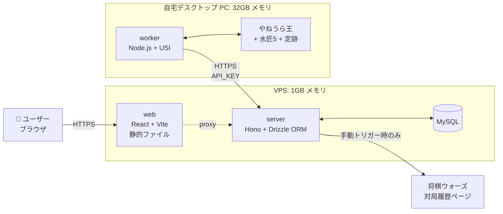
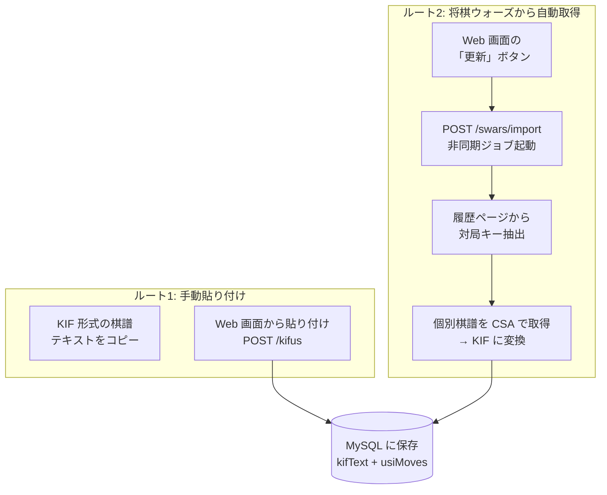
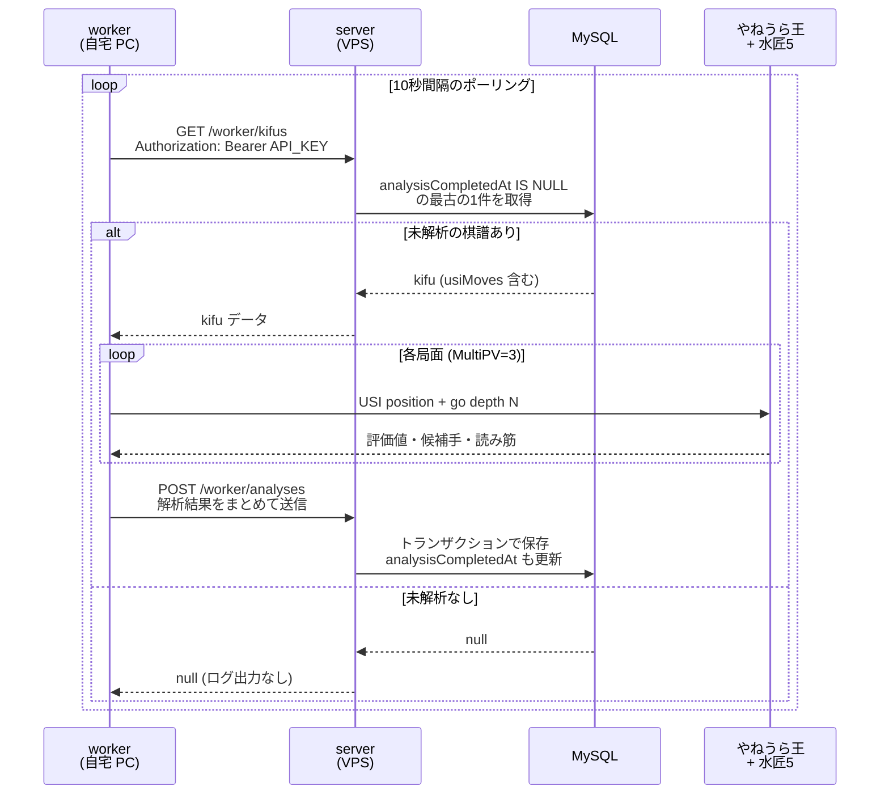

## はじめに

将棋ウォーズで対局した自分の棋譜を、空きリソースのある自宅デスクトップ PC で自動的に解析して、Web で見返せるようにする **Seseraki**（細流棋）という個人用 Web アプリを開発しています。

棋譜解析は CPU を結構使う処理なので、解析エンジンを動かすマシンと普段アクセスする Web サーバーを分けたくなります。せっかくなら **Web 側 → API サーバー → 解析ワーカー** という流れを「せせらぎ」に見立てたい...という発想で、その古い表記である「せせらき」と棋譜解析機能を組み合わせて命名しました。


*棋譜一覧画面（プレースホルダ）*


*棋譜詳細画面：将棋盤・評価値グラフ・候補手（プレースホルダ）*

:::message alert
**この Web アプリは公開していません**。手元で動かしているだけのものです。

理由は単純で、**「サーバー代を払って既存サービスより劣るものを公開する意味があまりない」** からです。世の中にはもっと強い解析エンジンを潤沢な計算資源で回している既存サービスがあります。

ただ、**「余っている自宅 PC を解析専用ワーカーに仕立て、Web サーバーと連携させる」** という構成自体は、家のマシンを活かしたい個人開発者にとって面白い題材だと思います。本記事ではその構成と、データがどう流れていくかに焦点を当てて紹介します。
:::

@[card](https://github.com/Daiius/seseraki)

## システム全体の構成

まずは登場人物（プロセス）と置き場所を整理します。



ポイントは次の通りです。

- **VPS には Web 側だけ置く**: 1GB メモリの安価な VPS でも動かせる軽量構成にしました
- **解析処理は自宅 PC が担当**: 32GB メモリの自宅デスクトップ PC で `worker` プロセスが解析エンジンを呼び出します
- **両者は HTTPS + API キーでつながる**: ワーカーが VPS 上のサーバーをポーリングして仕事を取りに行く Pull 型

VPS 側でも worker 動作を一応検討したのですが、**水匠5 の評価関数だけで 60MB 程度あり、1GB メモリでは余裕がなさすぎた** ため、解析はデスクトップ一択になりました。

### パッケージ構成

リポジトリは pnpm monorepo で、3 つのパッケージに分かれています。

| パッケージ | 役割        | 主要技術                                                |
| ---------- | ----------- | ------------------------------------------------------- |
| `web`      | 棋譜管理 UI | React 19, Vite, TanStack Router, Tailwind CSS + daisyUI |
| `server`   | API + DB    | Hono, Drizzle ORM (beta.20), MySQL, zod                 |
| `worker`   | 棋譜解析    | USI プロトコル, やねうら王                              |

**TypeScript フルスタック** で揃えており、`server` と `web` / `worker` の間は Hono RPC（`AppType` の export + `hc<AppType>`）で型を共有します。`shared` パッケージは作っていません。

:::message
Hono RPC については以下の記事でも触れているので、興味のある方はご覧ください。

@[card](https://zenn.dev/daiius/articles/separate-nextjs-to-vercel-api-db-self-host)
:::

## 棋譜データの流れ

このアプリで一番面白いのは「棋譜データがどうやって入ってきて、解析されて、表示されるか」という一連の流れだと思います。順番に見ていきます。

### 1. 棋譜の取り込み

棋譜の取り込みには 2 つのルートがあります。



**ルート1** は単純で、KIF 形式のテキストをフォームに貼り付けて送るだけです。

**ルート2** は「将棋ウォーズの対局履歴から自分の棋譜を自動的に持ってくる」機能です。Cloudflare Turnstile があるため自動ログインは諦め、**ブラウザで手動ログインして取得した `_web_session` Cookie を環境変数で渡す** という運用にしています。アクセス間隔は 3 秒以上空け、控えめに動かしています。

:::message alert
将棋ウォーズの対局履歴ページを直接スクレイピングするのは非公式アクセスに該当するので、**自分の棋譜のみ・低頻度で・自分用** に留めるのが大前提です。公開サービスに転用するつもりはありません。
:::

### 2. KIF を USI に変換して保存

棋譜データは MySQL に以下のような形で入ります。

| カラム | 内容 |
|--------|------|
| `kifText` | KIF 形式の原本テキスト（人間が読む用） |
| `usiMoves` | USI 形式の指し手列（解析エンジンに渡す用、JSON 配列） |
| `sente` / `gote` | 先手・後手プレイヤー名 |
| `swarsGameKey` | 将棋ウォーズの対局キー（重複防止用、UNIQUE） |
| `analysisCompletedAt` | 解析完了日時（NULL なら未解析、INDEX 付き） |

**KIF → USI の変換は server 側で棋譜登録時に一度だけ実行** します。worker 側に KIF パーサを持たせず、worker は USI 文字列だけを扱う設計です。これで worker のコードがシンプルになり、テストもしやすくなります。

### 3. ワーカーが「未解析の棋譜」を取りに行く

ここが面白いところで、**worker が server に向かってポーリングする Pull 型** にしています。



**Pull 型を選んだ理由** は、自宅 PC が VPS から直接アクセスできない（NAT の内側にいる、IP が変わる）状況に強いからです。worker 側だけが「サーバーに繋ぎに行ける」ことを前提にできるので、ファイアウォール周りで悩まずに済みます。

worker → server の認証は **`Authorization: Bearer <API_KEY>`** だけのシンプルな構成です。Web 側のユーザー認証（Cookie セッション）とは完全に別系統になっています。

### 4. 解析結果のスキーマ

1 局の棋譜に対して、各局面ごとに MultiPV（複数候補手）で解析するため、データは以下のように 3 階層になっています。

```
kifus (棋譜)
 └─ moveAnalyses (1手ごとの解析レコード)
     └─ candidateMoves (MultiPV の候補手, デフォルト3件)
         ├─ rank          # 1 = 最善
         ├─ move          # USI 表記
         ├─ scoreType     # "cp" | "mate"
         ├─ scoreValue    # cp なら centipawn, mate なら手数
         ├─ pv            # 読み筋 (USI 配列)
         └─ depth         # 探索深さ
```

外部キーは全部 `CASCADE` 削除です。「棋譜を消したら関連する解析もまるごと消える」という素直な構造にしています。

### 5. Web 画面での表示

棋譜詳細ページで、これらのデータを組み合わせて表示します。


*将棋盤・評価値グラフ・候補手の組み合わせ（プレースホルダ）*

主な機能はこんな感じです。

- **将棋盤**: 9x9 のテキスト盤面。スライダーで局面を移動できる
- **評価値グラフ**: SVG 直書きの折れ線グラフ。先手有利＝上、後手有利＝下。クリックで局面移動できる
- **悪手判定**: 局面評価値が手番側にとって 300cp 以上悪化し、かつ実手が候補手リスト外の場合に悪手判定。グラフ上にも ▲/△ マーカーが出る
- **候補手一覧**: 各候補に読み筋・探索深さ・最善手との差異・実手マークを表示

ここの実装は趣味全開なので、いつかもう少し詳しい記事に分けて書くかもしれません。

## なぜこの構成にしたか・トレードオフ

### Pull 型ポーリングを選んだ理由

最初は「server から worker に WebSocket で push したほうがリアルタイム感あって良くない？」と思ったのですが、

- 自宅 PC のグローバル IP は変わるし、ポート開放もしたくない
- 解析は数秒〜数分かかるので、リアルタイム性は別に必要ない
- worker が落ちて再起動しても、ポーリングなら自然に復帰する

ということで、**シンプルさとロバストさを取って Pull 型** にしました。10 秒ポーリングで困ったことは今のところありません。

### Drizzle ORM (beta) を採用

DB アクセスは Drizzle ORM です。1.0 正式リリースが近そうなので、**早めにキャッチアップする目的で beta.20 を採用** しました。Hono RPC 経由で **Drizzle が推論したカラム型情報がそのまま web 側まで伝わる** のが想像以上に快適です。

:::message
beta 版なので、今後の API 変更で多少書き直しは発生する想定です。個人プロジェクトなのでそのリスクは許容しています。
:::

### MySQL を選んだ理由

PostgreSQL でもよかったのですが、単純に **私が MySQL を触ってきた時間が長い** のと、**VPS で安価に運用するならどちらでも大差ない** ので、慣れている方を選びました。

## 公開しない理由をもう一度

冒頭でも書いたのですが、**このアプリを誰でも使える形で公開する予定はありません**。

| 観点 | 既存サービス | Seseraki |
|------|-------------|----------|
| 解析エンジン | 強い（最新評価関数 + 大量計算資源） | 水匠5 + 自宅 PC 1 台 |
| 同時解析数 | 多 | 1 局ずつ順番に |
| 安定性 | ◎ | 自宅 PC が落ちると止まる |
| サーバー代 | サービス側持ち | 私が払う |
| 自分の好みに合わせた UI | × | ◎（自由） |

「**自分専用なら、自分の好きな UI で・自分の好きな深さで・既存のリソースで動かせる**」という点だけが Seseraki の強みです。逆に言うと、**他人にとっての強みはほぼゼロ** なので、サーバー代を払ってまで公開する理由がありません。

ただ、**「家のマシンを活かしたい」「自分の使いやすい UI を作りたい」「TypeScript フルスタックで一通り組んでみたい」** あたりが揃うと、こういう構成は趣味として楽しいので、似た境遇の方の参考になればという気持ちでこの記事を書きました。

## おまけ：開発時の工夫

:::details Docker Compose Watch で開発体験を統一

`pnpm dev` で `docker compose watch` を起動し、db / server / web / worker を全部一気に立ち上げています。ファイル変更は `sync+restart` で自動同期・再起動、`pnpm-lock.yaml` 変更時はコンテナ再ビルドという設定にしています。

開発用の worker は **Material（駒得評価のみ）** の軽量エンジンを使っており、評価関数ファイルなしで動きます。本番用 Dockerfile では NNUE + 水匠5 + ペタブック定跡を同梱したイメージをデスクトップでビルドして使っています。
:::

:::details Hono RPC で型エラーが出たとき

エンドポイントが server 内部ファイルの型を返すと、`hc<AppType>(...)` の推論結果が遠い相対パスを参照して TS2742 が出ることがあります。

```typescript
// 一旦型を抜き出して付け直すと回避できる
type Client = ReturnType<typeof hc<AppType>>
export const client: Client = hc<AppType>(...)
```

地味ですが嵌まったポイントなのでメモ。
:::

## おわりに

Seseraki は「**自宅の余ったスペックを活かして、自分専用の棋譜解析環境を作る**」という、ごく個人的なモチベーションで始めた Web アプリです。

技術的な見どころは、

- **Pull 型ポーリングで、家の中の PC を NAT 越え不要のワーカーとして使う構成**
- **TypeScript フルスタック + Hono RPC で、解析データの型が DB から UI まで一気通貫で繋がる開発体験**
- **解析エンジン（やねうら王 + 水匠5 + ペタブック定跡）を Docker で同梱して、worker をデプロイ可能なイメージにする**

あたりになります。

公開はしませんが、構成や流れに関しては「自分も似たようなことをやってみたい」という方の参考になれば嬉しいです。気が向いたら、将棋盤や評価値グラフの SVG 描画、Drizzle + Hono RPC の型推論まわりなど、個別のテーマでもう少し踏み込んだ記事を書こうと思います。
