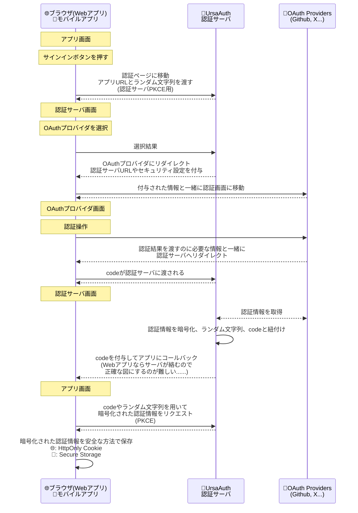
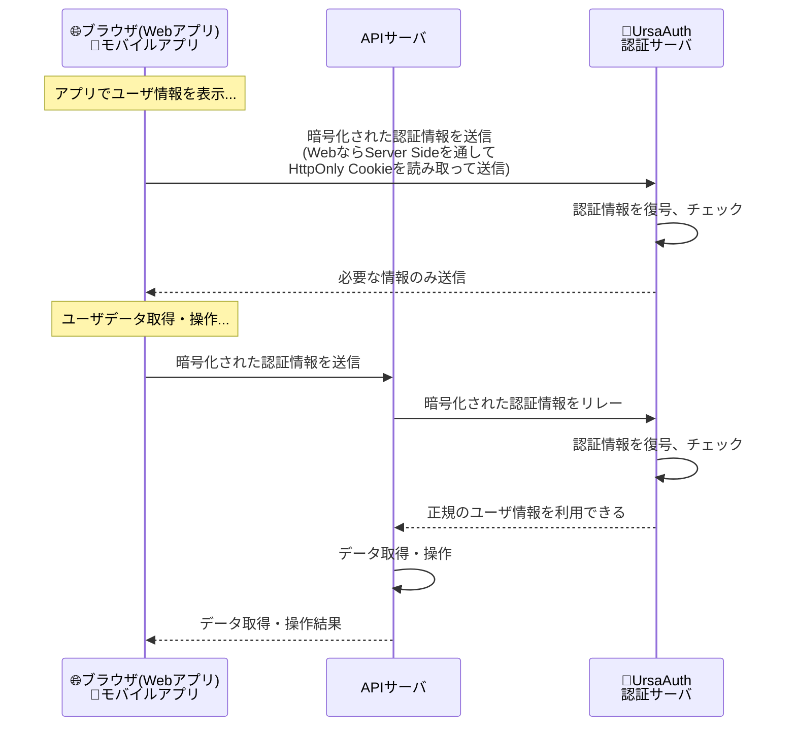

# どうして作ったのか？
個人開発で [Next.js](https://nextjs.org/) Webアプリケーションを作るのですが、モバイル版も作りたくなりました。

バックエンドにあるAPIサーバは両者で共通にしたいのですが、「**モバイルアプリからもアクセスされるAPIサーバの認証ってどうするか全然分からない......**」となりました。

:::details 例えば Web API にユーザID総当たりとかされたら大丈夫でしょうか？
**クライアントから渡されるデータは全部信用しないルール**があるので、**渡されたユーザIDがでたらめでないか検証できなければなりません**。

私が最初に思いついたAPIキー認証については、
- Web: サーバ側にだけAPIキーを置けるならまあアリそう
- モバイル: 端末側にある情報は解析されうるので❌

となるので、Web/モバイル両方大丈夫な方法にはならなそうです......
:::

[Firebase Authentication](https://firebase.google.com/docs/auth?hl=ja) や [Auth0](https://auth0.com/jp)という大変良さそうな認証サーバの選択肢があるのですが、以前Next.jsアプリケーションで使用した [Auth.js](https://authjs.dev/) が結構良かったことを思い出しました。

Auth.js は色々な OAuth/OIDC プロバイダにも対応しており、それらの振る舞いの差を吸収し暗号化された認証情報（JWE形式）を生成したりもします。

**便利なライブラリですが、Auth.js は OAuth/OIDC についてはクライアントとして振る舞うので、単にそれだけではちっとも認証サーバではありません**。
アプリケーションに組み込む形で、そのアプリケーションだけを認証するのが本来の使い方です。その動作にはCookieが必須であり、従ってブラウザ系の基盤に依存しない**モバイルアプリからの認証にも向いていません**。

でも、**何とかしてAuth.jsが生成するJWEを安全な方法で自分のWeb/モバイルアプリに渡せれば、何とかならないかなぁという方針**で進めてみました。

Auth.js は元々 Next.js 専用だったのですが、今は様々なフレームワークに対応しコア機能も独立で使えるため、それならやれるかも？というのもありました。

# 認証サーバ UrsaAuth, powered by Auth.js

*UrsaAuthのアイコン(念のためですが、クマちゃんです)*

## できること
- 対応している OAuth/OIDC プロバイダにユーザをリダイレクトし OAuth認証を行う
  (ここはモバイルでもブラウザ)
- 認証成功時に Auth.js が取得したユーザ情報をできるだけ安全な方法（PKCE）で認証を求めたアプリに渡す
  :::details PKCEって本来は OAuth 2.0 認証フローの一部のことなのですが......
  「あるクライアントの要求で作成されサーバに保存されている情報を、確実にその本人だけが取得するための方法」としても使えそうです
  :::

## できないこと
- 複数のOAuthプロバイダと1人のユーザを関連付けられない
  - 違うプロバイダでログインすると、違うアカウント扱いされてしまいます
  - ??? 違うOAuthプロバイダがたまたま同じIDを発行したらまずいのでは

# 動作イメージ
## 認証動作

## 認証情報の使用

