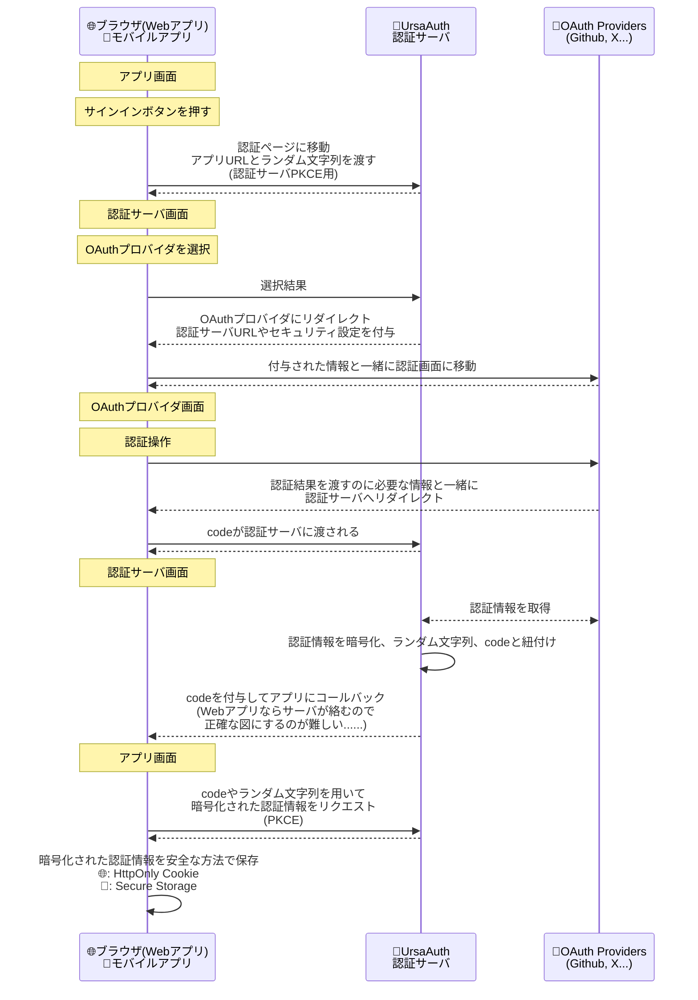
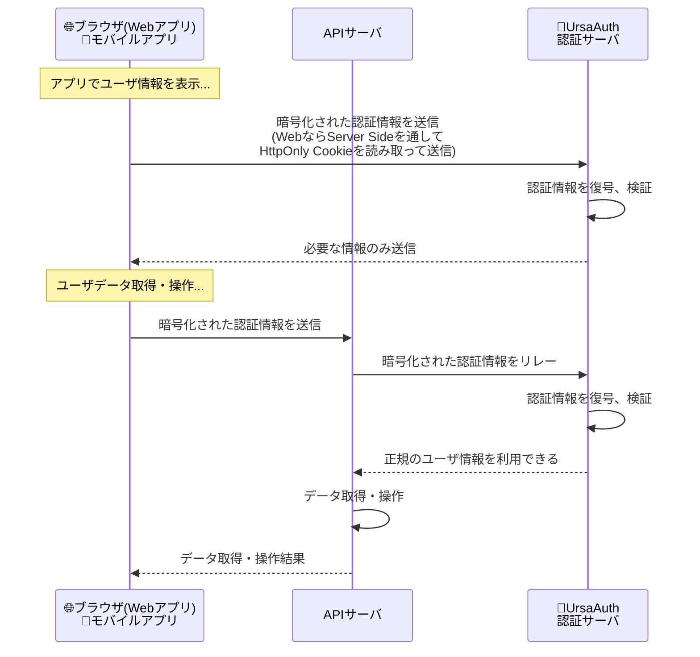

## 実験的認証サーバ UrsaAuth powered by Auth.js & TypeScript

*UrsaAuthのアイコン(クマちゃんです)*

@[card](https://github.com/Daiius/ursa-auth)

*Next.js での使用例：サインイン前*

*Next.js での使用例：サインイン画面(Auth.js のデフォルト画面を使用)*

*Next.js での使用例：サインイン後 Server Side Rendering でユーザ情報を取得して表示*

この記事では、**TypeScriptで開発中の実験的認証サーバ UrsaAuth を紹介します**。

Next.js や Auth.js を使う方、認証サーバ構築やそのセキュリティに興味のある方、TypeScript開発を行う方に興味を持って頂けるのではと思います。

こちらの記事投稿コンテストに参加させて頂きます！

@[card](https://zenn.dev/contests/contest2025ts)

### 技術スタック紹介
執筆時点での**リポジトリには3つのサーバが含まれており、全て TypeScript で開発しています**。
- **UrsaAuth 認証サーバ** : Hono, Auth.js
- **検証用 Next.js アプリ** (examples/next) : Next.js v15, App Router
- **検証用APIサーバ** (examples/api-server) : Hono

### TypeScript 開発のメリット
本文中でも TypeScript 開発で良いと感じるところを紹介していきますが、**全体に共通している大きなメリットにはこの様なものがあります**:

- **動作させないとエラーか分からないコードの量がグッと減り、開発に集中できる**
- **サーバサイドとクライアントサイドを同じ言語で開発できる**
  - コンテクストスイッチが少なく、手法によっては型情報の共有(RPC)も可

## どうして作ったのか？
個人開発で [Next.js](https://nextjs.org/) + [TypeScript](https://www.typescriptlang.org/) によるWebアプリケーションを作っています。

@[card](https://zenn.dev/daiius/articles/08c65823dae37d) 

@[card](https://zenn.dev/daiius/articles/441f35223269a6)

より柔軟な本番環境構成やモバイル版対応のため、**Next.js 内に記述していたバックエンド処理をAPIサーバに分離したい**と最近考え始めました。

バックエンドにあるAPIサーバは両者で共通にしたいのですが、「**モバイルアプリからもアクセスされるAPIサーバの認証ってどうするか全然分からない......**」となりました。

:::details 例えば Web API にユーザID総当たりとかされたら大丈夫でしょうか？
クライアントから渡されるデータは改竄されているかもしれませんので、**渡されたユーザIDがでたらめでないか検証できなければなりません**。

私が最初に思いついたAPIキー認証については、
- Web: サーバ側にだけAPIキーを置けるならまあアリそう
- モバイル: 端末側にある情報は解析されうるので❌

となるので、Web/モバイル両方大丈夫な方法にはならなそうです......
:::

[Firebase Authentication](https://firebase.google.com/docs/auth?hl=ja) や [Auth0](https://auth0.com/jp)、[Clerk](https://clerk.com/) という大変良さそうな認証サーバの選択肢があるのですが[^1]、以前Next.jsアプリケーションで使用した [Auth.js](https://authjs.dev/) が結構良かったことを思い出しました。

[^1]: Clerk は内部で Auth.js を使用している様です

@[card](https://authjs.dev/)

Auth.js は色々な OAuth/OIDC プロバイダにも対応しており、それらの振る舞いの差を吸収し暗号化された認証情報（JWE形式）を生成したりもします。

**便利なライブラリですが、Auth.js は OAuth/OIDC クライアントとして動作するので、単にそれだけではちっとも認証サーバではありません**。
アプリケーションに組み込む形で、そのアプリケーションだけを認証するのが本来の使い方です。その動作にはCookieが必須であり、従ってブラウザ系の基盤に依存しない**モバイルアプリからの認証にも向いていません**。

でも、**Auth.jsが生成するJWEを、安全な方法で自分のWeb/モバイルアプリに渡せれば何とかならないかなぁという方針で、TypeScriptの勉強も兼ねて進めてみました**。

**セキュリティ関連で気を付けなければならないポイントは、Auth.js の挙動と既存の認証サービスについて調査し、分かる範囲で真似する方針を取りました**。

:::message alert
つまり、**本来とは異なる使い方をすることで認証サーバの動作の勉強もしてみよう、というニュアンスに近いです**。
記事にしておいてなんですが、真似するのはお勧めできません......

**でも認証関連のセキュリティについて勉強になるのは本当です。**
:::

:::message
裏を返せばなのですが **Next.js + TypeScript 開発で完結出来るならば、バックエンドとフロントエンドがスムーズかつ型安全に連携動作します**ので、とても良い開発体験が得られます！

:::

## ポイントまとめ
- **Auth.js は HttpOnly Cookie を利用して、OAuth 認証時に必要な一時的な情報や暗号化された認証情報を保存します**
  - HttpOnly Cookie はクライアント側 JavaScript からアクセス不可能で、XSS耐性が高いです
  - クライアント側JavaScriptから読めないのでサーバサイド処理が増えるのですが、Next.js 等なら全く問題なく開発できます
  - でも脆弱性には注意が必要なので油断は禁物です（例: CVE-2025-29927）
- **UrsaAuth は暗号化された認証情報を、OAuth 2.0 の手続きの一部に使われるPKCEという方法を再度用いて、Auth.js からユーザの手元に届けます**
  - **認証情報を届ける先のアプリはホワイトリスト管理を確実にし**、開発元が不明なアプリに送信されるのを防ぎます
  - この認証情報を安全な場所に保存するのは、UrsaAuthを利用するアプリケーション側の責任で行います
  - 保存先は Webアプリケーションなら HttpOnly Cookie、モバイルなら Secure Storage が適切そうです
  - UrsaAuth 自身は現段階では OAuth Provider としては振舞えておらず、独自の認証方法になってしまっています

↓PKCEによる認証情報取得手続きの一部(全体はリンク先を参照下さい)

https://github.com/Daiius/ursa-auth/blob/25dd23c25d9ea5dbb19b3af691352ff30ab1ba4f/examples/next/src/app/ursa-auth/signin/route.ts#L21-L28

- **UrsaAuth を利用するアプリケーションは、ユーザ情報が必要な際に必ず認証サーバに問い合わせを行います**
  - 検証だけ行うための /validate エンドポイントと、内容を返す /me エンドポイントを持ちます
  - /validate は、Next.js middleware での認証・リダイレクトに向いています

↓UrsaAuth の /validate エンドポイント

https://github.com/Daiius/ursa-auth/blob/25dd23c25d9ea5dbb19b3af691352ff30ab1ba4f/src/index.ts#L210-L225

↓Next.js middleware で認証情報を検証を依頼する部分

https://github.com/Daiius/ursa-auth/blob/25dd23c25d9ea5dbb19b3af691352ff30ab1ba4f/examples/next/src/middleware.ts#L42-L44

## シーケンス図
### 認証動作
Web/モバイルアプリ、UrsaAuth、そして OAuth Provider の3者が関係します。

**この流れはOAuth認証フローを部分的に含みますが、ほとんど Auth.js が担当してくれます**。アプリと認証サーバ間のやりとりを検討、実装するのが開発時間の大半を占めます。

### 検証動作
保存された認証情報は認証サーバ内で暗号化されており、復号・検証が行えるのは認証サーバだけです。

## これから試すこと
- **Auth.js自体は確か30くらいのOAuthプロバイダに対応していますが、UrsaAuth はまだGitHub OAuth機能の設定のみです、他の認証もできるようにします**
  - 異なるOAuth Providerがたまたま同じIDを異なるユーザに発行しうる(OAuth Providerが割り当てるIDをそのまま使う)ことに対処します
  - OAuth Provider によって異なるユーザ情報を発行するのを吸収する仕組みを設けます
    - TypeScript の型情報を上手く使えば、型のミスマッチを検出しながら開発でき、かなりのミスをテスト前に防げます
- **原理的にはモバイルアプリからの認証も可能なので、実験してみます**
  - アプリ側では既存認証用ライブラリ+ちょっとした設定で済みそうな感じもあり、もう少し調査を進めます
- **現段階では UrsaAuth は軽量化を意識して Hono を使用していますが、リッチな認証画面を提供するために Next.js に変更するのもありそうです**
  - 認証元のアプリによって異なる、カスタマイズされた OAuth プロバイダ選択画面を表示してみたいです
    - テーマカラーを認証元と同じにする、特定の OAuth Provider と連携するために、おすすめの選択肢をきちんと示す など

## おわりに
認証関連の知識の再確認や、セキュリティ関連についても深掘りしながら、開発を継続して参ります。
いつか皆さんが私の開発したサービスを使用する際、クマちゃんアイコンの認証サーバが動いていたら、可愛がって下さると嬉しいです！！

